# B2 – Fortgeschrittene Sprachverwendung

**Themen:**

- Gesellschaftliche Themen (Politik, Umwelt, Wirtschaft)
- Kultur und Kunst
- Wissenschaftliche und technische Entwicklungen
- Globalisierung und Internationale Beziehungen
- Bildungssysteme
- Konflikte und Lösungsstrategien
- Technische Innovationen
- Migration und Integration

**Grammatik:**

- Konjunktiv II (Wunsch, Vorstellung)
- Konjunktiv I (Indirekte Rede)
- Bedingungssätze (1. und 2. Bedingung)
- Verben mit Präpositionen
- Passiv in verschiedenen Zeiten (Präsens, Perfekt, Futur)
- Nominalisierung von Verben
- Adjektivdeklination (starke, schwache, gemischte Deklination)
- Konjunktionen im Satzbau (dass, weil, obwohl, wenn)

---

# B2

## Pronominaladverbien

Der Pronominaladverb bezieht sich auf den Nebensatz.

- Die Qual beim Warten hängt _davon_ ab, wie man sich subjektiv fühlt
- Auf dem Flughafen in Houston haben sich viele Passagiere _darüber_ beschwert, dass sie so lange auf ihr Gepäck warten mussten
- Jetzt sind sie während der Wartezeit _damit_ beschäftigt, ans andere Ende des Flughafens zu laufen
- Man sollte nicht _darüber_ nachdenken, ob Wartezeit verlorene Zeit ist

## Konzessivangaben

- _Obwohl_
	- *Obwohl* die Enten mehr Platz in den Comics einnahmen, wurden die Hefte nach der Maus bennant
- _Auch wenn_
	- *Auch wenn* du keine Comics magst, solltest du mal ein Micky-Maus-Heft auf Deutsch lesen
- _Trotzdem_
- _Trotz_
	- *Trotz* aller Bedenken wurden die Hefte ein Erfolg
- _Ungeachtet_
	- *Ungeachtet* wiedeholter Warnungen von Pädagogen lasen viele Kinder Comics

>[!Note]
>_Trotz_ und _Ungeachtet_ sind in Genitiv

## Konjunktiv II

- Sagen Sie mir Bescheid, wenn Sie etwas neues erfahren
	- *Würden* Sie mir Bescheid sagen, wenn Sie etwas neues erfahren *würden*?
- Warten Sie bitte einen Moment, wir sind gleich fertig
	- *Würden* Sie bitte einen Moment warten? Wir sind gleich fertig
- Könnt ihr mir helfen?
	- *Könntet* ihr mir helfen?
- Wann hast du Zeit, um mit mir über die Planung zu sprechen?
	- *Hättest* du Zeit, um mit mir über die Planung zu sprechen?

>[!Note]
>Bei einiger starken Verben kann man alternativ zu *würde- + Infinitiv* auch die "klassiche" Konjunktivform II verwenden.
>- Gehen: Ich ginge, wir gingen
>- Wissen: Ich wüsste, wir wüssten
>- Kommen: Ich käme, wir kämmen

### Nachträgliche Feststellungen in der Vergangenheit

- Er *hätte* den Fehler als Möglichkeit zum Lernen *sehen sollen*
- Peter *hätte* den Fehler *zugeben müssen*
- Es *wäre* besser *gewesen*, wenn Peter seinen Fehler genau analysiert *hätte*
- Ich *hätte* gern mehr Zeit *gebracht*. Ich *wäre* gern dabei *gewesen*
- Wenn ich nicht *gearbeitet hätte*, *wäre* ich ins Fitnessstudio *gegangen*

## Nominalisierung von Verben

Man kann Nomen aus Verben bilden.

- Beispiele:
	- Viele Gegenstände *besitzen*
		- Der *Besitz* vieler Gegendstände
	- Materielle Güter *anhäufen*
		- Die *Anhäufung* materieller Güter
	- Auf Konsum *verzichten*
		- Der *Verzicht* auf Konsum
	- Sich auf ein Minimum *beschränken*
		- Die *Beschränkung* auf ein Minimum
	- Sich auf das Wesentliche *konzentrieren*
		- Die *Konzentration* auf das Wesentliche
    - Produkte präsentieren
      - *Produktpräsentation*
      - *Präsentation* von Produkten
    - Technische Daten dokumentieren
      - *Dokumentation* technischer Daten
      - *Dokumentation* von technischen Daten
    - Produktionsabläufe überwachen
      - *Überwachung* der Produktionsabläufe
      - *Überwachung* von Produktionsabläufen

## Indefinitpronomen

- Die indefiniten Pronomen: *man*, *jemand*, *niemand*, stehen für unbestimmte, unbekannte oder nicht näher bestimmte Personen

- Beispiele
	- *Man* hat das Gefühl, dass *einem* alles über den Kopf wächst, dass man überfordert ist
	- *Man* macht einfach öfter etwas, was *einen* glücklich macht
	- Aufräumen ist nicht einfach. Am besten ist es, wenn *man* das mit *jemandem* gemeinsam macht

## Konsekutivangaben

- *Sodass*
	- Die Gebrauchsdauer der Geräte wird mit allerei Tricks verkürzt, *sodass* die Konsumenten neue Geräte kaufen müssen
- *So... dass*
	- Es werden zur Herstellung bestimmter Geräte *so* viele Rohstoffe benötigt, *dass* die Rohstoffreserven knapp werden
- *Folglich/Demzufolge/Infolgedessen*
	- Einige Menschen verzichten bewusst auf Konsum und Besitz, *folglich/demzufolge/infolgedessen* belasten sie die Umwelt in geringerem Maße
- *Sonst/Andernfalls*
	- Die Menschen sollten bewusster und nachhaltiger konsumieren, *sonst/andernfalls* wird es einige Rohstoffe irgendwann nicht mehr geben
- *Infolge*
	- *Infolge* des steigenden Konsums werden einige Rohstoffe knapp

>[!Note]
>*Infolge* wird nur schriftsprachlich gebraucht

## Passiversatzformen

Werden oft in der mündlichen Kommunikation verwendet.

Sie stehen im Aktiv und umschreiben Passivkonstruktionen.

- *Möglichkeit*
	- Es kann biologisch abgebaut werden
		- Das Material ist biologisch *abbaubar*
	- Er kann nicht erklärt werden
		- Der jetzige Umgang mit dem Plastikmüll ist *unerklärlich*
	- Sie können in der Lebensmittelindustrie eingesetzt werden
		- Die neue Produkten *lassen sich* in der Lebensmittelindustrie *einsetzen*
- *Notwendigkeit*
	- Plastiktüten müssen vermieden werden
		- Die Verwendung von Plastiktüten *ist zu vermeiden*
- *Empfehlung*
	- Die Folgen für unsere Gesundheit dürfen/sollten nicht unterschätz werden
		- Die Folgen für unsere Gesundheit *sind nicht zu unterschätzen*

> [!Note]
>
> **Bekommen-Passiv:**
>
> Wird nur noch in umgangsprachlichen Fällen verwendet.
> 
> *Beispiele:* 
> - Der Blogger bekommt den Betrag bezahlt
> - Ich habe die Kosten erstattet bekommen
> Sie hat den Bonus ausgezahlt bekommen

## Relativkomparation und Vergleiche

- Das Rathaus in Köln ist *eins/eines* der ältesten Rathäuser Europas

Hier ist die Gruppe Rathäuser, im Singularform *Rathaus*, das Neutrum ist. Deshalb benutzen wir *ein/eines* wie die nächste Tabelle laut:

|          | Artikel    |
| -------- | ---------- |
| Maskulin | einer      |
| Feminin  | eine       |
| Neutrum  | eins/eines |

>[!Note]
>
> Erinnern Sie sich an die Adjektivdeklination im Nominativ, wenn es keine artikel gibt

- Der Berliner Fernsehturm ist *eins/eines* der höchsten Gebäude Europas
- Das Berliner Sinfonieorchester ist *eins/eines* der berühmtesten Orchester der Welt
- Die im Mittelalter erbaute Krämerbrücke in Erfurt ist *eine* der schönsten Brücken Deutschlands
- Der Leipziger Augustusplatz ist mit seinen 40.000 Quadratmetern *einer* der größten Stadplätze Europas
- Der Zoo Schönbrunn in Wien ist *einer* der beliebtesten Zoos der Welt
- Das Restaurant von Andreas Caminada in dem Schweizer Ort Fürstenau ist *ein/eines* der besten Restaurants Europas

>[!Note]
>Wenn das Subjekt feminin ist, benutzt man die Nominierte Version der Pronom "die" anstatt Genitiv

- Je grüner eine Stadt ist, desto/umso wohler fühlen sich die Menschen
- Je mehr Menschen in einer Stadt leben, desto/umso schwieriger wird die Wohnsituation
- Je älter ein Gebäude ist, desto/umso teurer wird die Restaurierung
- Je höher die Anzahl von Hochschulen und Universitäten in einer Stadt ist, desto/umso niedriger sind das Durschnittsalter der Einwohner

>[!Note]
>
> Satzbau:
> Nebensatz, + Steigerung des Adjektivs + Position I

## Adversativangaben

- *Dagegen*
	- Für die einen spielt regelmäßiger Urlaub die wichtigste Rolle, _dagegen_ legen andere mehr Wert auf eine schöne Wohnungseinrichtung
- *Während*
	- *Während* sich Untersuchungen zufolge zwei Drittel der Frauen in einem gemütlichen Zuhause mit vielen Kissen und Decken wohlfühlen, bevorzugt ein Drittel eine klar strukturierte Wohnungseinrichtung
- *Wohingegen*
	- Untersuchungen zufolge fühlen sich zwei Drittel der Frauen in einem gemütlichen Zuhause mit vielen Kissen und Decken wohl, *wohingegen* ein Drittel eine klar strukturierte Wohnungseinrichtung bevorzugt
- *Im Gegensatz zum*
	- *lm Gegensatz zum* steigenden Online-Umsatz beim Kauf von Büchern, Reisen oder neuen elektronischen Geräten ist der Wochenendausflug ins Möbelhaus bei der Auswahl eines Einrichtungsgegenstandes immer noch die wichtigste Inspirationsquelle

## Finalangaben

Diese beide Strukture können ebenfalls Finalität ausdrücken.

- _Zu+ Dativ_
	- Zur optimalen Vorbereitung auf den Arztbesuch recherchieren viele Menschen ihre Krankheitssymptome im Internet
- *Für + Akkusativ*
	- Für das Gespräch mit dem Arzt sammle ich einige Informationen im Netz

Beispiele:
- Um vertrauenswürdige Ergebnisse zu bekommen, muss man sich für die Suche Zeit nehmen
	- Für vertrauenswürdige Ergebnisse muss man sich für die Suche Zeit nehmen
- Einige Leute recherchieren ihre Symptome nach dem Arztbesuch, um die Diagnose zu überprüfen
	- Zur Überprüfung der Diagnose recherchieren einige Leute ihre Symptome nach dem Arztbesuch
- Medizinische Hinweise im Netz sind oft in einfacher Sprache geschrieben, damit sie jeder versteht
	- Für ein besseres Verständnis sind medizinische Hinweise im Netz oft in einfacher Sprache geschrieben
- Petra besucht medizinische Onlineforen, um von den Ehfahrungen anderer Patienten zu lernen
	- Zum Erfahrungsaustausch besucht Petra medizinische Onlineforen
- Bei der Suche nach medizinischen Tipps sollte man nicht auf der ersten Seite hängenbleiben, damit man verschiedene Meinungen zu einem Thema lesen kann
	- Für eine größere Meinungsvielfalt sollte man nicht bei der Suche medizinischen Tipps auf der ersten Seite hängenbleiben

## Vermutungen ausdrücken

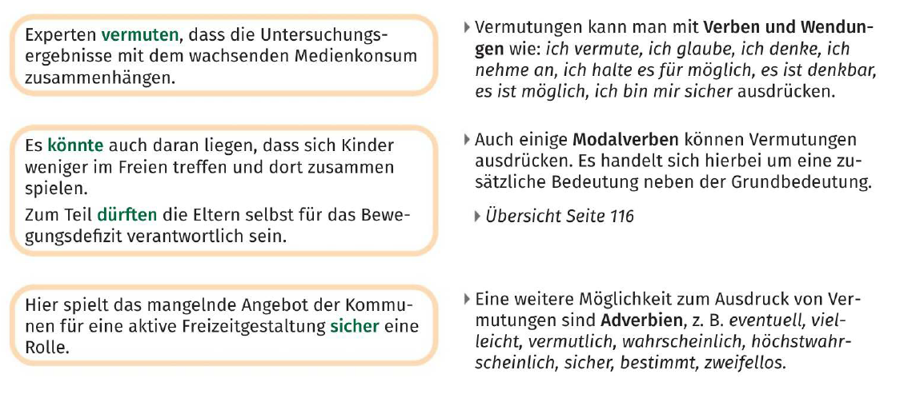
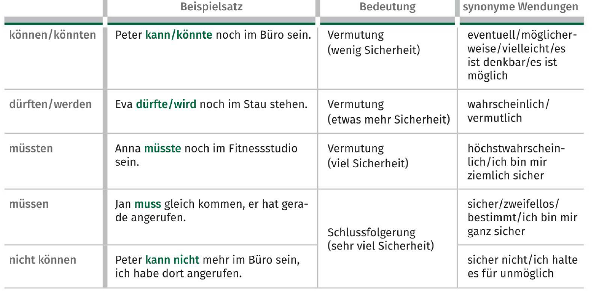

Beispiele:
- Sport macht ihm keinen Spaß
  - Sport könnte ihm keinen Spaß machen
- Er hat sicher gesundheitliche Gründe
  - Er muss gesundheitliche Gründe haben

## Konditionalangaben

**Verbalform:**
- *Wenn*
  - *Wenn* man beim Lernen spazieren geht, kann man sich besser an das Gelernte erinnern
- *Falls*
  - Ich kann dir einen Tipp geben, *falls* du dich für einen Sprachkurs interessierst

**Nominalform:**
- *Beim + Dativ*
  - *Beim  Spazierengehen* kann man sehr gut lernen
- *Ohne + Akkusativ*
  - *Ohne regelmäßige Wiederholung* vergisst man das Gelernte schnell

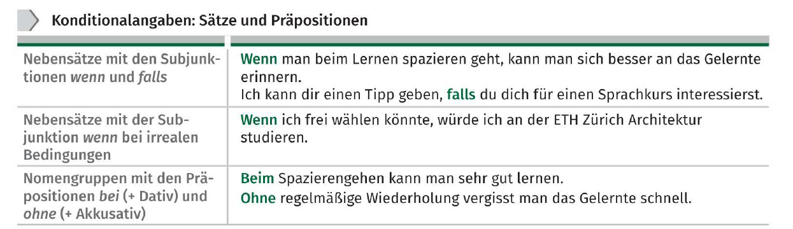

## Pro- und Kontra-Argumentation mit zweiteiligen Satzverbindungen

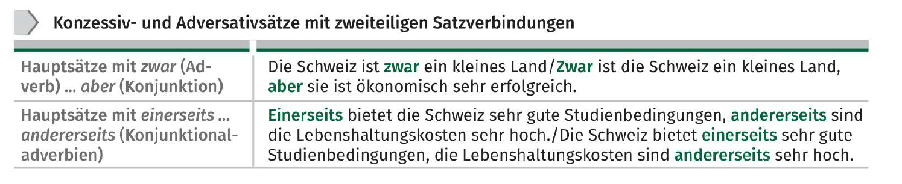

- *Zwar...aber*
	- Die Schweiz ist *zwar* ein kleines Land, *aber* sie ist ökonomisch sehr erfolgreich
	- Es gibt an den Schweizer Unis *zwar* in der Regel keine Zulassungsbeschränkung, *aber* an der Uni St. Gallen muss man eine Aufnahmeprüfung bestehen
	- Das Leben in der Schweiz ist *zwar* für ausländische Studierende sehr teuer, *aber* es kommen immerhin 27 Prozent der Studierende aus dem Ausland 
- *Einerseits...andererseits*
	- *Einerseits* bietet der Schweiz sehr gute Studienbedingungen, *andererseits* sind die Lebenshaltungskosten sehr hoch
	- *Einerseits* möchte Justus nach dem Abitur studieren, *andererseits* würde er gern in der Welt herumreisen
	- *Einerseits* müssen die Studierende viel lernen, *andererseits* haben viele Studierende einen Nebenjob

## Adjektive und Partizipien als Nomen

- Nächste Woche finden Schulungen für *Lehrende* zur Verbesserung der medialen Kompetenzen statt
- Die meisten *Angestellten* haben eine Kündigungsfrist von sechs Wochen
- *Beamte* arbeiten im öffentlichen Dienst
- Bei der Mitarbeiterführung können *Vorgesetzter* viele Fehler machen
- Hier finden Sie Angebote für Kinder und *Jugendliche*

## Motivationschreiben

Das folgende Motivationschreiben wurde an der ältesten Universität der Schweiz geleitet. Also es enthält Besonderheiten.

- In der Schweiz folgt nach der Anrede gar nichts, in Deutschland steht ein Komma
- Das erste Wort im ersten Satz wird großgeschrieben, in Deutschland klein
- In der Schweiz gibt es kein *ß*. Die Schweizer schreiben dafür *ss*
- Die Schweizer schätzen Höflichkeit und Zurückhaltung. Wenn es passt, verwendet man dafür den Konjunktiv II
- Der richtige Gruß lautet in der Schweiz: *Freundliche Grüsse*

Deutsches Beispiel:

## Lebenslauf

Der Lebenslauf sollte:
- Wie das Bewerbungsanschreiben einen Bezug zur Stellenausschreibung haben
- Zwei Seiten nicht überschreiten
- In einer übersichtlichen tabellarischen Form verfasst werden
- Eine Bewerbungsphoto am rechten Hand oder in der oberen Mitte enthalten
- Neben persönlichen Angaben auch Informationen über die Berufserfahrung, die Ausbildung, die berufliche Weiterbildung, verschiedene Kentnisse und besondere Tätigkeiten bieten
- Am Ende mit der Unterschrift versehen werden

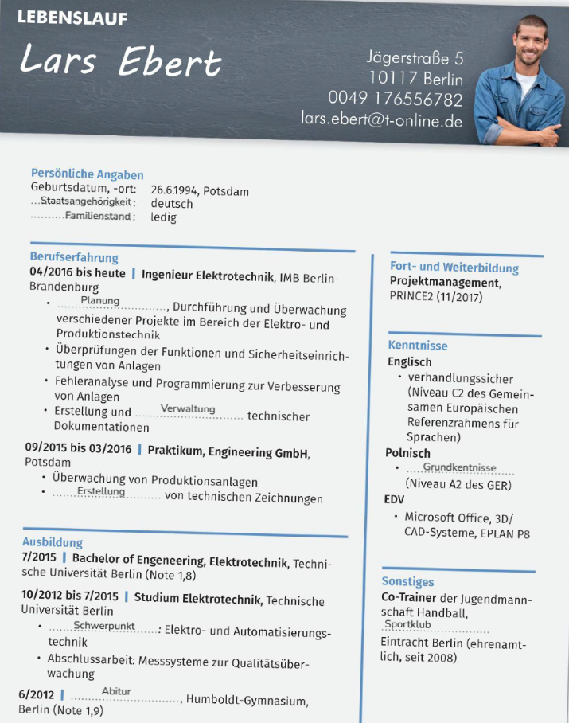

## Partizip II und I als Adjektiv

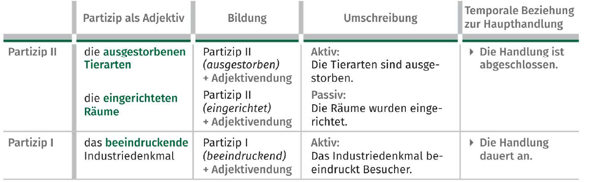

Erweiterte Partizipen findet man vor allem in der Schriftsprache, z.B. in beschreibenden Texten Oder wissenschaftlichen Publikationen:
- Der Alpenzoo ist vor allem für seine Wiederansiedlungsprojekte *von in Tirol bereits ausgestorbenen* Tierarten bekannt
- Besucher können die *mit Originalmöbeln eingerichteten* Räume besichtigen 
- Das beeindruckende Industriedenkmal *mit seiner vom Bauhaus beeinflussten* Architektur ist heute ein Zentrum für Kunst und Kultur

**Beispiele:**
- ...die *vom Bauhaus beeinflustete* Architektur
  - Die Architektur wurde vom Bauhaus beeinflust
- ...das *von Martin Luther übersetzte* Neue Testament
  - ...das Neue Testament wurde von Martin Luther übersetzt
- ...das *von 1788 bis 1793 erbaute* Brandenburger Tor
  - Das Brandenburger Tor wurde von 1788 bis 1793 erbaut
- Fast 60 Reiseveranstalter orientieren sich insbesondere an den Wünschen der Kunden, denen *ökologische und soziale Aspekte berücksichtigende* Angebote wichtig sind
  - Die Angebote, die ökologische und soziale Aspekte berücksichtigen, sind wichtig
- Die Internationale Tourismus-Börse war im letzten Jahr die am meisten besuchte Reisemesse
  - Die Internationale Tourismus-Börse war im letztes Jahr die Reisemesse, die am meisten besucht wurde
- Die *im Netz geplante* Reise ist heute der Normalfall
  - Die Reise, die im Netz geplant wurde, ist heute der Normalfall
- Die Alternative zum *auf Papier gedruckten* Reiseführer ist heute eine Smartphone-App
  - Die Alternative zum Reiseführer, der auf Papier gedruckt wurde, ist heute eine Smartphone-App 

## Die n-Deklination maskuliner Nomen

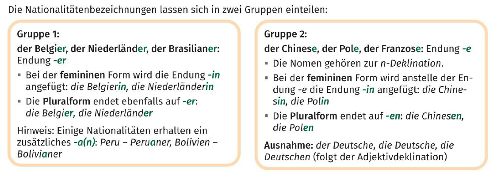

## Modalangaben

- *Dadurch... dass*
	- Diese Unterschiede können zum Beispiel *dadurch* entstehen, *dass* die im Labor getesteten Mengen von Nährstoffen im Rahmen unserer täglichen Essgewohnheiten gar nicht aufgenommen werden
	- Mann kann bessere Ergebnisse *dadurch* erzielen, *dass* man ergebnisoffen arbeitet
- *Indem*
	- Das konnten Gesundheitswissenschaftler der Stanford University belegen, *indem* sie in einem Studienvergleich ein Wirrwar an Ergebnissen aufgelistet haben
	- Man kann sich gesund ernähren, *indem* man ein paar Regeln einhält
	- Man kann etwas für die Umwelt tun, *indem* man beim Einkaufen auf Plastikbeutel verzichtet
- *Durch*
	- Neben den bereits aufgezählten positiven Effekten kann man angeblich *durch* regelmäßigen Kaffekonsum das Risiko einschränken, an Parkinson, Alzheimer-Demenz und Depressionen zu erkranken
	- *Durch* den Vergleich mehrerer Ernährungsstudien haben Wissenschaftler widersprüchliche Empfehlungen entdeckt
- *Mithilfe*
	- *Mithilfe* einer ergebnisorientierten Untersuchungsmethode kamen einige Forscher zu dem erwarteten Resultat
- *Mit*
	- *Mit* einer Diät nimmt man nich dauerhaft ab

## Die Wortstellung im Mittelfeld

Die normale Reihenfolge laut:

> [!Note]
> 1. Temporal (wann?)
> 2. Kausal (warum?)
> 3. Modal und instrumental (wie? mit wem? womit?)
> 4. Lokal (wo? wohin?)

**Beispiele:**
- Vincent wohnt seit zwei Jahren, aus Kostengründen, mit seinen Kommilitonen in einem Zimmer im Studentenwohnheim
	- Te
		- seit zwei Jahren
	- Ka
		- aus Kostengründen
	- Mo
		- mit seinen Kommilitonen
	- Lo
		- in einem Zimmer im Studentenwohnheim

- *Nach Meinung vieler Wissenschaftler werden im Jahr 2050 auf der Erde* rund zehn Milliarden Menschen leben
- *Nach Aussagen von Ernährungsexperten kann man zukünftig mithilfe von Insekten* einen Teil der Ernährungsprobleme lösen
- *Den Verzehr von Insekten hat in den letzten Jahren mithilfe einiger Start-up-Unternehmen in Europa* zugenommen
- *Die Firmengründder kamen während eines Thailandurlaubs* auf diese Geschäftsidee
- *Insekten bieten den Menschen in ärmeren Ländern* viel Eiweiß, wichtige Vitamine und Mineralien

> [!Note]
> Wichtig zu achten ist, dass tekamolo keine absolute Regel ist, als man kann in den Beispiele merken (TE-KA-MO-LO gilt nur, solange keine Mehrdeutigkeit entsteht). 
> 
> Sieht dir die hervohebenen Abschnitte der Sätze an, die Regel gilt nur da

**Einige Hakenfälle:**
- *Fall 1: Lokal*
	- Falsch
		- Er verkauft Autos in Deutschland
	- Richtig
		- *Er verkauft in Deutschland* Autos
	- Grund
		- Der Verkäufer befindet sich in Deutschland, nicht besonders die Autos
- *Fall 2: Mehrere Objekte + Lokal am Ende*
	- Falsch
		- Die Firma bietet Kunden neue Produkte und Dienstleistungen in Europa
	- Richtig
		- *Die Firma bietet Kunden in Europa* neue Produkte und Dienstleistungen
- *Fall 3: Abstrakte Aussagen / Statistik*
	- Falsch
		- Der Fleischkonsum ist bei jungen Menschen besonders hoch in Städten
	- Richtig
		- *Der Fleischkonsum ist in Städten* bei jungen Menschen besonders hoch
	- Grund
		- Es würde *Junge Menschen in Städten* behaupten, was ist besonders unklar
- *Fall 4: Relativ lange Nominalgruppen*
	- Falsch
		- Man findet viele vegetarische Angebote für Studierende an Universitäten in Großstädten
	- Richtig
		- *Man findet in Großstädten* viele vegetarische Angebote für Studierende an Universitäten
	- Grund
		- Universitäten in Großstädten oder Angebote dort?

---

---

## Das Agens im Passivsatz

**Beispiele:**
- Das Smartphone kann *durch* das Heruntaladen der App mit einer Schadsoftware infiziert werden
- Auch kosten können *durch* den Drohneneinsatz reduziert werden
- Mit dem GPS-Sender werden die Tiere *von* ihren Besitzern überwacht
- Die Firma wurde 2016 *von* zwei Brüdern gegrünndet
- Das Projekt wurde mit 100 000 Euro *von* der Universität unterstützt

## Umformung von Aktivsätzen in Passivsätze

**Beispiele:**
- Die Ingenieure entwickelten einen kleinen Satelliten zur Beobachtung der Erde aus dem Weltall
	- Zur Beobachtung der Erde aus dem Weltall wurde ein klein Satellit entwickelt
- Für die Entwicklung des Mini-Satelliten benötigten die Gründer viel Zeit und Geld
	- Für die Entwicklung des Mini-Satelliten wurde viel Zeit und Geld benötigt
- Im Jahr 2017 konnte die Firma BST den ersten Stelliten im Auftrag der Universität Singapur ins All schießen
	- Der erste Satellit konnte im Jahr 2017 im Auftrag der Universitöt Singapur ins All geschossen werden
- In den waschmaschinengroßen Satelliten hat man ganz normale Konsumentenprodukte wie Teile eines Fotoapparats eingebaut
	- In den waschmaschinengroßen Satelliten wurden Ganz normale Konsumentenprodukte wie Teile eines Fotoapparats eingebaut
- Dadurch konnte man die Herstellungskosten eines Satelliten von 50 Millionen auf 5 Millionen Euro reduzieren
	- Dadurch konnten die Herstellungskosten eines Satelliten von 50 Millionen auf 5 Millionen Euro reduziert werden

## Verschiedenen Präpositionen

### Präpositionen für Instrumentalangaben

- *Mithilfe*
- *Durch*
- *Mittels*
	- *Mittels* eines neuen Navigationsgeräts finden Radfahrer in 200 europäischen Städten schnell ihr Ziel
- *Mit*
- *Anhand*
	- Ich erkläre Ihnen den Vorgang am besten *anhand* eines Beispiels

> [!Note]
> *Mittels* wird fast ausschließlich schriftsprachlich verwendet

### Präpositionen für Kausal- und Konsekutivangaben

- *Dank*
	- *Dank* des neuen Schutzmantels können die Drohnen durch schwer zugängliche Räume fliegen
	- *Dank* dem schnellen Internet ist jetzt Kommunikation mit den entferntesten Orten möglich
- *Mangels*
	- Start-ups geraten oft *mangels* ausreichender Nachfrage in Schwierigkeiten
- *Wegen*
	- *Wegen* unzureichender finanzieller Mittel mussten die Firmengründer aufgeben
	- *Wegen* dir muss ich heute länger im Büro bleiben
- *Aufgrund*
- *Angesichts*
	- *Angesichts* der vielen Insolvenzen sollten Start-up-Gründer den Markt vorher besser analysieren
- *Aus*
	- *Aus* Angst vor dem Scheitern gründen viele Erfinder dein eigenes Unternehmen
- *Vor*
	- Die Chefin strahlte *vor* Freude über den Erfolg
- *Infolge*
	- *Infolge* massiven Beschwerden wurde das Produkt vom Markt genommen

> [!Note]
> 
> Die Präposition *wegen* wird normalerweise mit dem Genitiv gebraucht. Allerdings
> verwendet man umgangssprachlich und bei Personalpronomen oft den Dativ: *wegen dir*.
> Die Alternative zu *wegen dir* ist *deinetwegen*

> [!Note]
> Bei der kausalen Verwendung von *aus* und *vor* steht das Nomen oft ohne Artikel

## Redepartikeln

## Temporalsätze

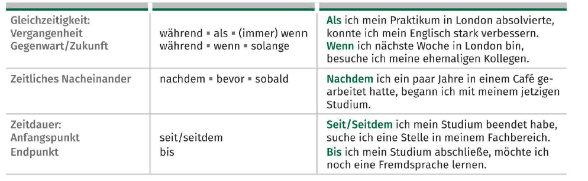

- *Nachdem*
  - *Nachdem* ich ein paar Jahre in einem Café gearbeitet hatte, begann ich mit meinem jetzigen Studium
- *Während*
  - *Während* ich Germanistik studierte, stieg mein Interesse an Mode
- *Bevor*
  - *Bevor* ich mit dem Studium begann, hatte ich keine konkreten Berufswünsche
- *Als*
  - *Als* ich mein Praktikum in London absolvierte, konnte ich mein Englisch stark verbessern
- *Wenn*
  - *Wenn* ich heute in London bin, besuche ich meine ehemaligen Kolleginnen und Kollegen
- *Bis*
  - *Bis* ich mein Studium abschließe, möchte ich noch eine Fremdsprache lernen
- *Solange*
  - *Solange* ich diesen Job machen muss, bin ich nicht wirklich glücklich
- *Seit/Seitdem*
  - *Seit/Seitdem* ich mein Studium beendet habe, suche ich eine Stelle in meinem Fachbereich
- *Immer*
  - *Immer* wenn mir jemand seine Meinung zu meinen Ideen sagte, habe ich mich beeinflussen lassen
- *Sobald*
  - *Sobald* mir der letzte Bericht vorliegt, beginne ich mit der Auswertung

## Verben im Konjunktiv II

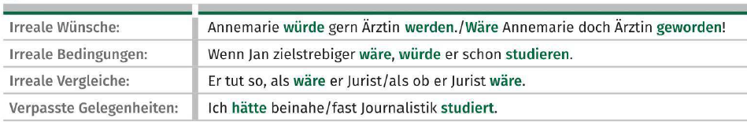

**Beispiele:**
- *Verpasste Gelegenheiten*
  - Senta war eine gute Schwimmerin
    - Sie hätte beinahe an den Olympischen Spielen teilgenommen
  - Andreas hat nur im Büro gesessen und sich nicht bewegt
    - Er hätte beinahe Probleme mit seinem Herzen bekommen
  - Hans hat mal wieder die falsche Taste gedrückt
    - Diesmal hätte er fast die Festplatte formatiert
-  *Bedingungssätze in der Vergangenheit*
   -  Wenn Senta fleißiger trainiert hätte, hätte sie an den Olympischen Spielen teilnehmen können
   -  Wenn Andreas sich mehr bewegt hätte, hätte er keine Probleme mit seiner Gesundheit gehabt
   -  Wenn ich disziplinierter gewesen wäre, hätte ich meinen ersten Roman schreiben können
-  *Irreale Vergleiche*
   -  Beate benimmt sich, als wäre sie hier die Chefin
   -  Stefan tat in der Besprechung so, als ob er sich für das Projekt interessieren würde
   -  Bernd hat heute so viel Geld ausgegeben, als hätte er im Lotto gewonnen

## Adjektive und ihre Ergänzungen

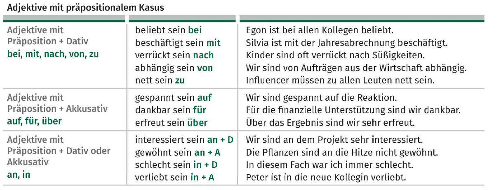

**Beispiele:**
- Die Influencerin ist ihre Anhänger *für* das positive Feedback sehr dankbar
- Die Firma ist *an* einer Zusammenarbeit mit dem Influencer interessiert
- Er ist *auf* die Reaktionen gespannt
- Doch viele User sind *von* Nicos Videos total begeistert
- Bist du *mit* der Veröffentlichung deines Kommentars einverstanden?

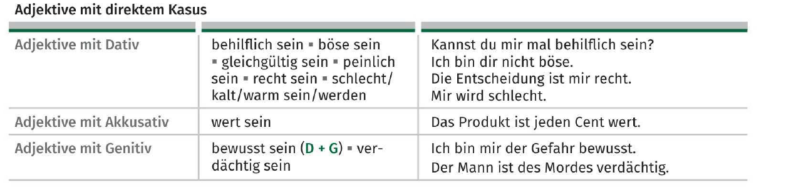

**Beispiele:**
- Mir ist kalt
- Das kann dir doch nict gleichgültig sein!

## Untersuchungsergebnisse wiedergeben

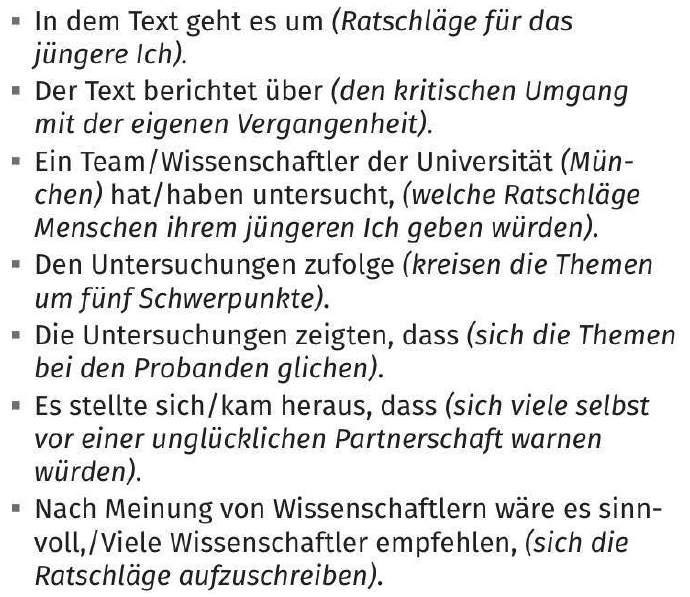

## Vorgänge und Zustände im Passiv

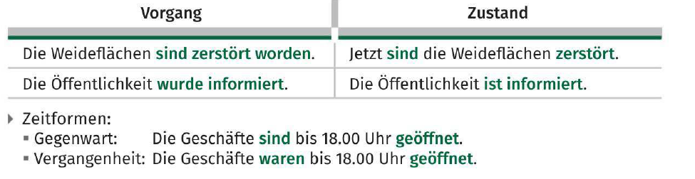

**Beispiele:**
- Die Meere sind überfischt worden
  - Die Meere sind überfischt
- Ein Teil des Lebensraums der Insekten ist vergiftet worden
  - Ein Teil des Lebensraum der Insekten ist vergiftet
- Die Öffentlichkeit wurde über die dramatische Entwicklung informiert
  - Die Öfentlichkeit ist über die dramatische Entwicklung informiert

## Funktionen von werden

### Futur II

- *In der Zukunft abgeschlossene Aktionen*
	- Meine Freunde *werden* um diese Uhrzeit schon *angerufen haben*
	- Ich *werde* morgen um 8:00 Uhr *angekommen sein*
- *Vermutungen in der Vergangenheit*
	- Er *wird* kran *gewesen sein*
	- Er *wird* lieber an die großen Demonstration in Berlin *teilgenommen haben*
	- Er *wird* mit dem Konferenzprogramm nicht einverstanden *gewesen sein*
	- Er *wird* ein wichtiges Gespräch mit dem Verkehrsminister *gehabt haben*
	- Er *wird* den Sinn der Konferenz *bezweifelt haben*

> [!Note]
> Man kann auch Vermutungen in der Vergangenheit ausdrücken mit *wohl* oder *vermutlich*.
> - Ihr Leben hat sich *wohl* sehr verändert
> - Er hat *vermutlich* gut gespielt

## Nomen mit präpositionaler Ergänzung

**Beispiele:**
- Schon als Kind hatte Julius ein großes Interesse *an* der Natur
- Im letzten Jahr hatte er die Gelegenheit *zu* einem Praktikum in Kanada
- Es gibt einen Bedarf *an* gut ausgebildeten Naturschützern
- Experten haben kiene Zweifel *an* der Existenz des Klimawandels
- Gleichzeitig haben sie Hoffnung *auf* eine Verbesserung der Situation

## Jemandem widersprechen/Zweifel anmelden

