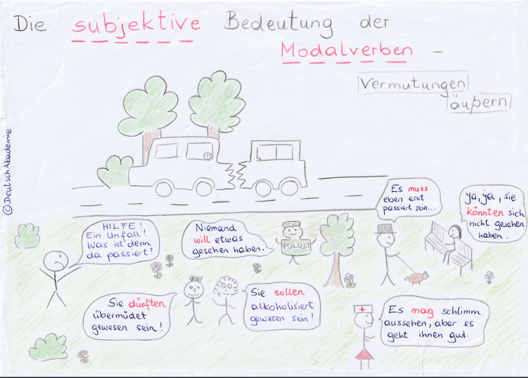
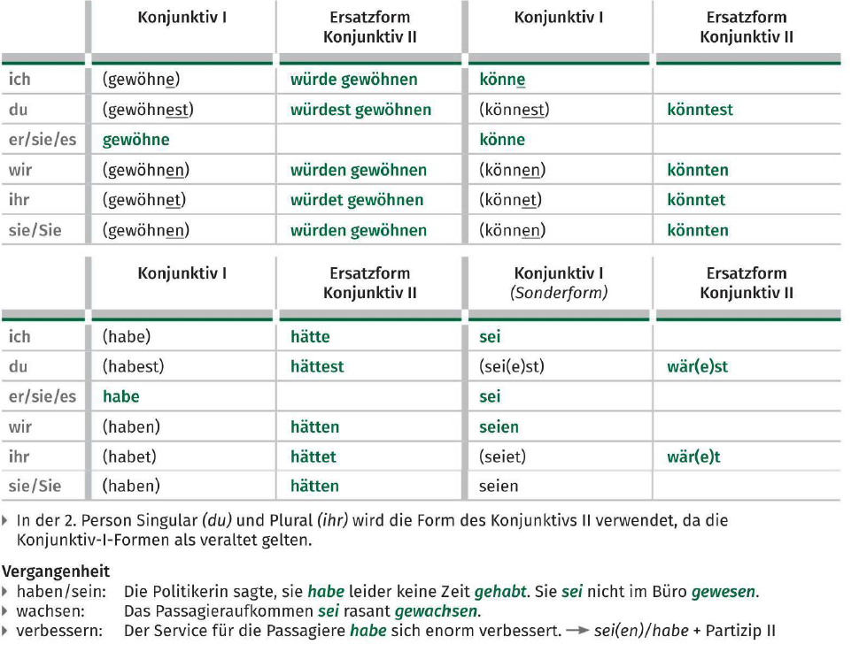
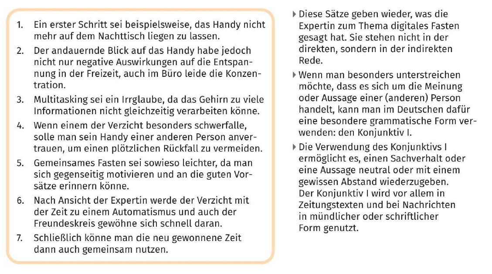
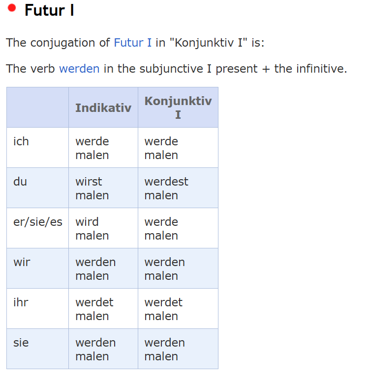
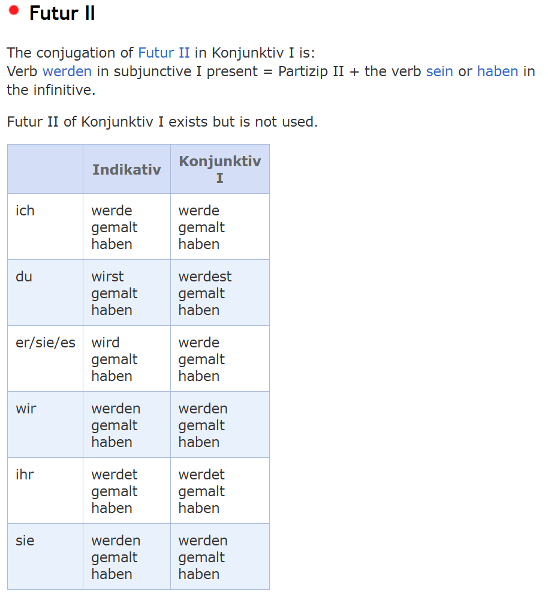
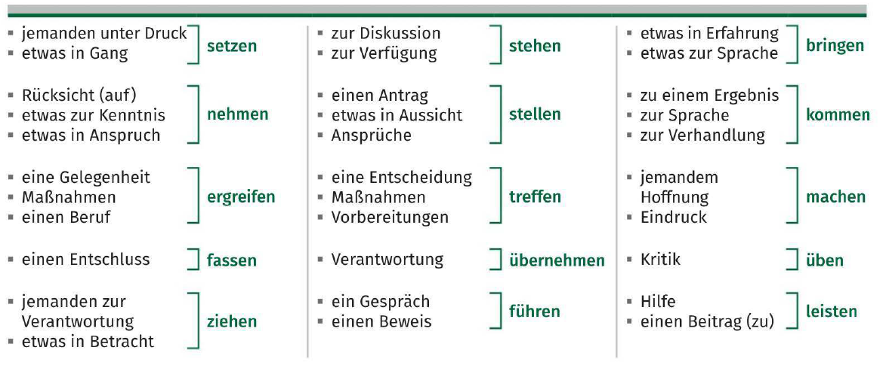
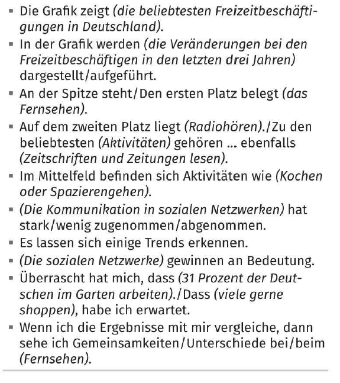

# B2 – Fortgeschrittene Sprachverwendung

**Themen:**

- Gesellschaftliche Themen (Politik, Umwelt, Wirtschaft)
- Kultur und Kunst
- Wissenschaftliche und technische Entwicklungen
- Globalisierung und Internationale Beziehungen
- Bildungssysteme
- Konflikte und Lösungsstrategien
- Technische Innovationen
- Migration und Integration

**Grammatik:**

- Konjunktiv II (Wunsch, Vorstellung)
- Konjunktiv I (Indirekte Rede)
- Bedingungssätze (1. und 2. Bedingung)
- Verben mit Präpositionen
- Passiv in verschiedenen Zeiten (Präsens, Perfekt, Futur)
- Nominalisierung von Verben
- Adjektivdeklination (starke, schwache, gemischte Deklination)
- Konjunktionen im Satzbau (dass, weil, obwohl, wenn)

## Pronominaladverbien

Der Pronominaladverb bezieht sich auf den Nebensatz.

- Die Qual beim Warten *hängt davon ab*, wie man sich subjektiv fühlt
- Auf dem Flughafen in Houston haben sich viele Passagiere *darüber beschwert*, dass sie so lange auf ihr Gepäck warten mussten
- Jetzt sind sie während der Wartezeit *damit beschäftigt*, ans andere Ende des Flughafens zu laufen
- Man sollte nicht *darüber nachdenken*, ob Wartezeit verlorene Zeit ist
- Die technische Verbesserung von Raumsonden und TeIeskopen *führt dazu*, dass immer wieder neue Planeten entdeckt werden

## Konzessivangaben

- _Obwohl_
 	- _Obwohl_ die Enten mehr Platz in den Comics einnahmen, wurden die Hefte nach der Maus bennant
- _Auch wenn_
 	- _Auch wenn_ du keine Comics magst, solltest du mal ein Micky-Maus-Heft auf Deutsch lesen
- _Trotzdem_
- _Trotz_
 	- _Trotz_ aller Bedenken wurden die Hefte ein Erfolg
- _Ungeachtet_
 	- _Ungeachtet_ wiedeholter Warnungen von Pädagogen lasen viele Kinder Comics

>[!Note]
>_Trotz_ und _Ungeachtet_ sind in Genitiv

## Konjunktiv II

- Sagen Sie mir Bescheid, wenn Sie etwas neues erfahren
 	- _Würden_ Sie mir Bescheid sagen, wenn Sie etwas neues erfahren _würden_?
- Warten Sie bitte einen Moment, wir sind gleich fertig
 	- _Würden_ Sie bitte einen Moment warten? Wir sind gleich fertig
- Könnt ihr mir helfen?
 	- _Könntet_ ihr mir helfen?
- Wann hast du Zeit, um mit mir über die Planung zu sprechen?
 	- _Hättest_ du Zeit, um mit mir über die Planung zu sprechen?

>[!Note]
>Bei einiger starken Verben kann man alternativ zu _würde- + Infinitiv_ auch die "klassiche" Konjunktivform II verwenden.
>
>- Gehen: Ich ginge, wir gingen
>- Wissen: Ich wüsste, wir wüssten
>- Kommen: Ich käme, wir kämmen

### Nachträgliche Feststellungen in der Vergangenheit

- Er _hätte_ den Fehler als Möglichkeit zum Lernen _sehen sollen_
- Peter _hätte_ den Fehler _zugeben müssen_
- Es _wäre_ besser _gewesen_, wenn Peter seinen Fehler genau analysiert _hätte_
- Ich _hätte_ gern mehr Zeit _gebracht_. Ich _wäre_ gern dabei _gewesen_
- Wenn ich nicht _gearbeitet hätte_, _wäre_ ich ins Fitnessstudio _gegangen_

## Nominalisierung von Verben

Man kann Nomen aus Verben bilden.

- Beispiele:
 	- Viele Gegenstände _besitzen_
  		- Der _Besitz_ vieler Gegendstände
 	- Materielle Güter _anhäufen_
  		- Die _Anhäufung_ materieller Güter
 	- Auf Konsum _verzichten_
  		- Der _Verzicht_ auf Konsum
 	- Sich auf ein Minimum _beschränken_
  		- Die _Beschränkung_ auf ein Minimum
 	- Sich auf das Wesentliche _konzentrieren_
  		- Die _Konzentration_ auf das Wesentliche
  - Produkte präsentieren
    - _Produktpräsentation_
    - _Präsentation_ von Produkten
  - Technische Daten dokumentieren
    - _Dokumentation_ technischer Daten
    - _Dokumentation_ von technischen Daten
  - Produktionsabläufe überwachen
    - _Überwachung_ der Produktionsabläufe
    - _Überwachung_ von Produktionsabläufen

## Indefinitpronomen

- Die indefiniten Pronomen: _man_, _jemand_, _niemand_, stehen für unbestimmte, unbekannte oder nicht näher bestimmte Personen

### Personen

- Beispiele
 	- _Man_ hat das Gefühl, dass _einem_ alles über den Kopf wächst, dass man überfordert ist
 	- _Man_ macht einfach öfter etwas, was _einen_ glücklich macht
 	- Aufräumen ist nicht einfach. Am besten ist es, wenn _man_ das mit _jemandem_ gemeinsam macht

### Andere

- **Zeit**
  - Irgendwann
  - Nie
  - Niemals
  - Nirgendwann
- **Dinge**
  - Irgendwas
  - Irgendein
    - Heute Mittag habe ich schnell _irgendein_ Brötchen gegessen, weil ich nicht viel Hunger hatte
  - Etwas
  - Eins
  - Nichts
  - Keins
- **Orte**
  - Irgendwo
  - Irgendwoher
  - Irgendwohin
  - Nirgendwo
  - Nirgends
  - Nirgendwoher
  - Nirgendwohin

## Konsekutivangaben

- _Sodass_
 	- Die Gebrauchsdauer der Geräte wird mit allerei Tricks verkürzt, _sodass_ die Konsumenten neue Geräte kaufen müssen
- _So... dass_
 	- Es werden zur Herstellung bestimmter Geräte _so_ viele Rohstoffe benötigt, _dass_ die Rohstoffreserven knapp werden
- _Folglich/Demzufolge/Infolgedessen_
 	- Einige Menschen verzichten bewusst auf Konsum und Besitz, _folglich/demzufolge/infolgedessen_ belasten sie die Umwelt in geringerem Maße
- _Sonst/Andernfalls_
 	- Die Menschen sollten bewusster und nachhaltiger konsumieren, _sonst/andernfalls_ wird es einige Rohstoffe irgendwann nicht mehr geben
- _Infolge_
 	- _Infolge_ des steigenden Konsums werden einige Rohstoffe knapp

>[!Note]
>_Infolge_ wird nur schriftsprachlich gebraucht

## Passiversatzformen

Werden oft in der mündlichen Kommunikation verwendet.

Sie stehen im Aktiv und umschreiben Passivkonstruktionen.

- _Möglichkeit_
 	- Es kann biologisch abgebaut werden
  		- Das Material ist biologisch _abbaubar_
 	- Er kann nicht erklärt werden
  		- Der jetzige Umgang mit dem Plastikmüll ist _unerklärlich_
 	- Sie können in der Lebensmittelindustrie eingesetzt werden
  		- Die neue Produkten _lassen sich_ in der Lebensmittelindustrie _einsetzen_
- _Notwendigkeit_
 	- Plastiktüten müssen vermieden werden
  		- Die Verwendung von Plastiktüten _ist zu vermeiden_
- _Empfehlung_
 	- Die Folgen für unsere Gesundheit dürfen/sollten nicht unterschätz werden
  		- Die Folgen für unsere Gesundheit _sind nicht zu unterschätzen_

### Gerundiv

Alternative _Passiversatzform_.

**Struktur:** zu + Partizip I + Adjektivendung

- Die Gebühr, die bezahlt werden muss
  - Die _zu bezahlende_ Gebühr

**Beispiele:**

- Die _zu fahrenden_ Kilometer
- Das _zu beaufsichtigende_ Kind
- Der _zu mähende_ Rasen

> [!Note]
>
> **Bekommen-Passiv:**
>
> Wird nur noch in umgangsprachlichen Fällen verwendet.
>
> _Beispiele:_
>
> - Der Blogger bekommt den Betrag bezahlt
> - Ich habe die Kosten erstattet bekommen
> Sie hat den Bonus ausgezahlt bekommen

## Modaladverbien

Sie stehen oft am Satzanfang. Normalerweise in einem Satz zwischen der kausalen und der lokalen Ergänzungen.

- *Qualität (Art und Weise)*
  - Anstandslos
  - Umsonst
  - Insgeheim
  - Genauso
  - Kurzerhand
  - Blindings
  - Schnurstracks
  - Anders
  - Folgendermaßen
  - Geradeaus
  - Rundheraus
  - Vergebens
  - Nebenbei bemerkt
  - Einigermaßen
  - Gezwungenermaßen
  - Jedenfalls
- *Quantität (Menge und Ausmaß)*
  - Haufenweise
  - Massenweise
  - Scharenweise
  - Literweise
  - Unbekannterweise
  - Größtenteils
  - Normalerweise
- *Wahrscheinlichkeit*
  - Wahrscheinlich
  - Vermutlich
  - Womöglich
  - Sicher(lich)
  - Möglicherweise
  - Bestimmt
  - Natürlich
- *Emotion*
  - Leider
  - Hoffentlich
  - Unglücklicherweise
  - Bedauerlicherweise
- *Glaubwürdigkeit*
  - Anscheinend
  - Wirklich
  - Zweifellos
  - Offentsichtlich
  - Bekanntlich

## Graduierung

Graduierungsadverben sind nicht zu deklinieren.

**Verstärkung:**

- Sehr
- Ganz
- Extrem
- Absolut
- Total
- Voll
- Enorm
- Besonders
- Wahnsinnig
- Außerordentlich
- Unglaublich
- Überaus
- Schwer
- Übertrieben

**Abschwächung:**

- Einigermaßen
- Kaum
- Wirklich
- Ziemlich
- Auch
- Etwas
- Nur
- Schwach
- Leicht
- Wenig
- Überhaupt
- Schrecklich

**Beispiele:**
- Heute ist es _ziemlich_ kalt
- _Schön_ langsam habe ich keine Lust mehr
- Das geht _ganz_ einfach
- Der Film ist _grauenhaft_ langweilig

## Modalsatz mit "ohne ... zu + Infinitiv" + "ohne dass"

- *"ohne ... zu + Infinitiv"* drückt das Gegenteil von einem Finalsatz mit *"um .... zu + Infinitiv"* aus
- *"ohne dass"* drückt das Gegenteil vom Finalsatz mit *"damit"* aus

**Beispiele:**
- Er lief über die Straße, *ohne dass* er den Verkehr beachtete
- Er lief über die Straße, *ohne* den Verkehr *zu* beachten
- Du fährst mit dem Auto, *ohne dass* du tankst
- Du fährst mit dem Auto, *ohne zu* tanken
- *Ohne* Tanken führst du mit dem Auto

## Relativkomparation und Vergleiche

- Das Rathaus in Köln ist _eins/eines_ der ältesten Rathäuser Europas

Hier ist die Gruppe Rathäuser, im Singularform _Rathaus_, das Neutrum ist. Deshalb benutzen wir _ein/eines_ wie die nächste Tabelle laut:

|          | Artikel    |
| -------- | ---------- |
| Maskulin | einer      |
| Feminin  | eine       |
| Neutrum  | eins/eines |

>[!Note]
>
> Erinnern Sie sich an die Adjektivdeklination im Nominativ, wenn es keine artikel gibt

- Der Berliner Fernsehturm ist _eins/eines_ der höchsten Gebäude Europas
- Das Berliner Sinfonieorchester ist _eins/eines_ der berühmtesten Orchester der Welt
- Die im Mittelalter erbaute Krämerbrücke in Erfurt ist _eine_ der schönsten Brücken Deutschlands
- Der Leipziger Augustusplatz ist mit seinen 40.000 Quadratmetern _einer_ der größten Stadplätze Europas
- Der Zoo Schönbrunn in Wien ist _einer_ der beliebtesten Zoos der Welt
- Das Restaurant von Andreas Caminada in dem Schweizer Ort Fürstenau ist _ein/eines_ der besten Restaurants Europas
- Aus Sicht der Versicherungswirtschaft machten verheerende Stürme in den USA und die Überschwemmungen in Europa das Jahr 2021 *zu einem* der teuersten Naturkatastrophenjahre

>[!Note]
>Wenn das Subjekt feminin ist, benutzt man die Nominierte Version der Pronom "die" anstatt Genitiv

- Je grüner eine Stadt ist, desto/umso wohler fühlen sich die Menschen
- Je mehr Menschen in einer Stadt leben, desto/umso schwieriger wird die Wohnsituation
- Je älter ein Gebäude ist, desto/umso teurer wird die Restaurierung
- Je höher die Anzahl von Hochschulen und Universitäten in einer Stadt ist, desto/umso niedriger sind das Durschnittsalter der Einwohner

>[!Note]
>
> Satzbau:
> Nebensatz, + Steigerung des Adjektivs + Position I

## Adversativangaben

- _Dagegen_
 	- Für die einen spielt regelmäßiger Urlaub die wichtigste Rolle, _dagegen_ legen andere mehr Wert auf eine schöne Wohnungseinrichtung
- _Während_
 	- _Während_ sich Untersuchungen zufolge zwei Drittel der Frauen in einem gemütlichen Zuhause mit vielen Kissen und Decken wohlfühlen, bevorzugt ein Drittel eine klar strukturierte Wohnungseinrichtung
- _Wohingegen_
 	- Untersuchungen zufolge fühlen sich zwei Drittel der Frauen in einem gemütlichen Zuhause mit vielen Kissen und Decken wohl, _wohingegen_ ein Drittel eine klar strukturierte Wohnungseinrichtung bevorzugt
- _Im Gegensatz zum_
 	- _lm Gegensatz zum_ steigenden Online-Umsatz beim Kauf von Büchern, Reisen oder neuen elektronischen Geräten ist der Wochenendausflug ins Möbelhaus bei der Auswahl eines Einrichtungsgegenstandes immer noch die wichtigste Inspirationsquelle

## Finalangaben

Diese beide Strukture können ebenfalls Finalität ausdrücken.

- _Zu+ Dativ_
 	- Zur optimalen Vorbereitung auf den Arztbesuch recherchieren viele Menschen ihre Krankheitssymptome im Internet
- _Für + Akkusativ_
 	- Für das Gespräch mit dem Arzt sammle ich einige Informationen im Netz

Beispiele:

- Um vertrauenswürdige Ergebnisse zu bekommen, muss man sich für die Suche Zeit nehmen
 	- Für vertrauenswürdige Ergebnisse muss man sich für die Suche Zeit nehmen
- Einige Leute recherchieren ihre Symptome nach dem Arztbesuch, um die Diagnose zu überprüfen
 	- Zur Überprüfung der Diagnose recherchieren einige Leute ihre Symptome nach dem Arztbesuch
- Medizinische Hinweise im Netz sind oft in einfacher Sprache geschrieben, damit sie jeder versteht
 	- Für ein besseres Verständnis sind medizinische Hinweise im Netz oft in einfacher Sprache geschrieben
- Petra besucht medizinische Onlineforen, um von den Ehfahrungen anderer Patienten zu lernen
 	- Zum Erfahrungsaustausch besucht Petra medizinische Onlineforen
- Bei der Suche nach medizinischen Tipps sollte man nicht auf der ersten Seite hängenbleiben, damit man verschiedene Meinungen zu einem Thema lesen kann
 	- Für eine größere Meinungsvielfalt sollte man nicht bei der Suche medizinischen Tipps auf der ersten Seite hängenbleiben

## Vermutungen ausdrücken

Beispiele:

- Sport macht ihm keinen Spaß
  - Sport könnte ihm keinen Spaß machen
- Er hat sicher gesundheitliche Gründe
  - Er muss gesundheitliche Gründe haben

### Die subjektive Bedeutung von Modalverben

**Grad der Sicherheit:**
- Könnten
  - Sie *könnten* sich nicht gesehen haben
- Dürfen
  - Sie *dürften* übermüdet gewesen sein!
- Müssen
  - Es *muss* eben erst passiert sein

**Andere:**
- Wollen
  - Niemand *will* etwas gesehen haben
    - Niemand behauptet von dich selbst, etwas gesehen zu haben
    - Der Sprecher signalisiert dabei Skepsis oder Distanz
- Sollen
  - Sie *sollen* alkoholisiert gewesen sein
    - Es wird berichtet, dass sie alkoholisiert gewesen seien
- Mögen
  - Es *mag* schlimm aussehen, aber es geht ihnen gut
    - Obwohl der Anschein negativ ist, geht es ihnen gut

## Konditionalangaben

**Verbalform:**

- _Wenn_
  - _Wenn_ man beim Lernen spazieren geht, kann man sich besser an das Gelernte erinnern
- _Falls_
  - Ich kann dir einen Tipp geben, _falls_ du dich für einen Sprachkurs interessierst

**Nominalform:**

- _Beim + Dativ_
  - _Beim  Spazierengehen_ kann man sehr gut lernen
- _Ohne + Akkusativ_
  - _Ohne regelmäßige Wiederholung_ vergisst man das Gelernte schnell

## Pro- und Kontra-Argumentation mit zweiteiligen Satzverbindungen

- _Zwar...aber_
 	- Die Schweiz ist _zwar_ ein kleines Land, _aber_ sie ist ökonomisch sehr erfolgreich
 	- Es gibt an den Schweizer Unis _zwar_ in der Regel keine Zulassungsbeschränkung, _aber_ an der Uni St. Gallen muss man eine Aufnahmeprüfung bestehen
 	- Das Leben in der Schweiz ist _zwar_ für ausländische Studierende sehr teuer, _aber_ es kommen immerhin 27 Prozent der Studierende aus dem Ausland
- _Einerseits...andererseits_
 	- _Einerseits_ bietet der Schweiz sehr gute Studienbedingungen, _andererseits_ sind die Lebenshaltungskosten sehr hoch
 	- _Einerseits_ möchte Justus nach dem Abitur studieren, _andererseits_ würde er gern in der Welt herumreisen
 	- _Einerseits_ müssen die Studierende viel lernen, _andererseits_ haben viele Studierende einen Nebenjob

## Adjektive und Partizipien als Nomen

- Nächste Woche finden Schulungen für _Lehrende_ zur Verbesserung der medialen Kompetenzen statt
- Die meisten _Angestellten_ haben eine Kündigungsfrist von sechs Wochen
- _Beamte_ arbeiten im öffentlichen Dienst
- Bei der Mitarbeiterführung können _Vorgesetzter_ viele Fehler machen
- Hier finden Sie Angebote für Kinder und _Jugendliche_

## Motivationschreiben

Das folgende Motivationschreiben wurde an der ältesten Universität der Schweiz geleitet. Also es enthält Besonderheiten.

- In der Schweiz folgt nach der Anrede gar nichts, in Deutschland steht ein Komma
- Das erste Wort im ersten Satz wird großgeschrieben, in Deutschland klein
- In der Schweiz gibt es kein _ß_. Die Schweizer schreiben dafür _ss_
- Die Schweizer schätzen Höfflichkeit und Zurückhaltung. Wenn es passt, verwendet man dafür den Konjunktiv II
- Der richtige Gruß lautet in der Schweiz: _Freundliche Grüsse_

Deutsches Beispiel:

## Lebenslauf

Der Lebenslauf sollte:

- Wie das Bewerbungsanschreiben einen Bezug zur Stellenausschreibung haben
- Zwei Seiten nicht überschreiten
- In einer übersichtlichen tabellarischen Form verfasst werden
- Eine Bewerbungsphoto am rechten Hand oder in der oberen Mitte enthalten
- Neben persönlichen Angaben auch Informationen über die Berufserfahrung, die Ausbildung, die berufliche Weiterbildung, verschiedene Kentnisse und besondere Tätigkeiten bieten
- Am Ende mit der Unterschrift versehen werden

## Partizip II und I als Adjektiv

Erweiterte Partizipen findet man vor allem in der Schriftsprache, z.B. in beschreibenden Texten Oder wissenschaftlichen Publikationen:

- Der Alpenzoo ist vor allem für seine Wiederansiedlungsprojekte _von in Tirol bereits ausgestorbenen_ Tierarten bekannt
- Besucher können die _mit Originalmöbeln eingerichteten_ Räume besichtigen
- Das beeindruckende Industriedenkmal _mit seiner vom Bauhaus beeinflussten_ Architektur ist heute ein Zentrum für Kunst und Kultur

**Beispiele:**

- ...die _vom Bauhaus beeinflustete_ Architektur
  - Die Architektur wurde vom Bauhaus beeinflust
- ...das _von Martin Luther übersetzte_ Neue Testament
  - ...das Neue Testament wurde von Martin Luther übersetzt
- ...das _von 1788 bis 1793 erbaute_ Brandenburger Tor
  - Das Brandenburger Tor wurde von 1788 bis 1793 erbaut
- Fast 60 Reiseveranstalter orientieren sich insbesondere an den Wünschen der Kunden, denen _ökologische und soziale Aspekte berücksichtigende_ Angebote wichtig sind
  - Die Angebote, die ökologische und soziale Aspekte berücksichtigen, sind wichtig
- Die Internationale Tourismus-Börse war im letzten Jahr die am meisten besuchte Reisemesse
  - Die Internationale Tourismus-Börse war im letztes Jahr die Reisemesse, die am meisten besucht wurde
- Die _im Netz geplante_ Reise ist heute der Normalfall
  - Die Reise, die im Netz geplant wurde, ist heute der Normalfall
- Die Alternative zum _auf Papier gedruckten_ Reiseführer ist heute eine Smartphone-App
  - Die Alternative zum Reiseführer, der auf Papier gedruckt wurde, ist heute eine Smartphone-App

## Die n-Deklination maskuliner Nomen

## Modalangaben

- _Dadurch... dass_
 	- Diese Unterschiede können zum Beispiel _dadurch_ entstehen, _dass_ die im Labor getesteten Mengen von Nährstoffen im Rahmen unserer täglichen Essgewohnheiten gar nicht aufgenommen werden
 	- Mann kann bessere Ergebnisse _dadurch_ erzielen, _dass_ man ergebnisoffen arbeitet
 	- Ausländische Absolventinnen und Absolventen tragen *dadurch* zur Internationalisierung bei, *dass* sie später als Alumni oder Multiplikator/-innen Kontakt zu Deutschland halten
 	- *Dadurch* entstehen Waldbrände, *dass* es nie regnet
 	- Der Erfolg solchen Kontrollen kann also nur *dadurch* garantiert werden, *dass* diese Kontrollen unangemeldet stattfinden
	 	- *Alternativ:* Der Erfolg solchen Kontrollen kann also nur *dann* garantiert werden, *wenn* diese Kontrollen unangemeldet stattfinden
- _Indem_
 	- Das konnten Gesundheitswissenschaftler der Stanford University belegen, _indem_ sie in einem Studienvergleich ein Wirrwar an Ergebnissen aufgelistet haben
 	- Man kann sich gesund ernähren, _indem_ man ein paar Regeln einhält
 	- Man kann etwas für die Umwelt tun, _indem_ man beim Einkaufen auf Plastikbeutel verzichtet
- _Durch_
 	- Neben den bereits aufgezählten positiven Effekten kann man angeblich _durch_ regelmäßigen Kaffekonsum das Risiko einschränken, an Parkinson, Alzheimer-Demenz und Depressionen zu erkranken
 	- _Durch_ den Vergleich mehrerer Ernährungsstudien haben Wissenschaftler widersprüchliche Empfehlungen entdeckt
- _Mithilfe_
 	- _Mithilfe_ einer ergebnisorientierten Untersuchungsmethode kamen einige Forscher zu dem erwarteten Resultat
- _Mit_
 	- _Mit_ einer Diät nimmt man nich dauerhaft ab

## Die Wortstellung im Mittelfeld

Die normale Reihenfolge laut:

> [!Note]
>
> 1. Temporal (wann?)
> 2. Kausal (warum?)
> 3. Modal und instrumental (wie? mit wem? womit?)
> 4. Lokal (wo? wohin?)

**Beispiele:**

- Vincent wohnt seit zwei Jahren, aus Kostengründen, mit seinen Kommilitonen in einem Zimmer im Studentenwohnheim
 	- Te
  		- seit zwei Jahren
 	- Ka
  		- aus Kostengründen
 	- Mo
  		- mit seinen Kommilitonen
 	- Lo
  		- in einem Zimmer im Studentenwohnheim

- _Nach Meinung vieler Wissenschaftler werden im Jahr 2050 auf der Erde_ rund zehn Milliarden Menschen leben
- _Nach Aussagen von Ernährungsexperten kann man zukünftig mithilfe von Insekten_ einen Teil der Ernährungsprobleme lösen
- _Den Verzehr von Insekten hat in den letzten Jahren mithilfe einiger Start-up-Unternehmen in Europa_ zugenommen
- _Die Firmengründder kamen während eines Thailandurlaubs_ auf diese Geschäftsidee
- _Insekten bieten den Menschen in ärmeren Ländern_ viel Eiweiß, wichtige Vitamine und Mineralien

> [!Note]
> Wichtig zu achten ist, dass tekamolo keine absolute Regel ist, als man kann in den Beispiele merken (TE-KA-MO-LO gilt nur, solange keine Mehrdeutigkeit entsteht).
>
> Sieht dir die hervohebenen Abschnitte der Sätze an, die Regel gilt nur da

**Einige Hakenfälle:**

- _Fall 1: Lokal_
 	- Falsch
  		- Er verkauft Autos in Deutschland
 	- Richtig
  		- _Er verkauft in Deutschland_ Autos
 	- Grund
  		- Der Verkäufer befindet sich in Deutschland, nicht besonders die Autos
- _Fall 2: Mehrere Objekte + Lokal am Ende_
 	- Falsch
  		- Die Firma bietet Kunden neue Produkte und Dienstleistungen in Europa
 	- Richtig
  		- _Die Firma bietet Kunden in Europa_ neue Produkte und Dienstleistungen
- _Fall 3: Abstrakte Aussagen / Statistik_
 	- Falsch
  		- Der Fleischkonsum ist bei jungen Menschen besonders hoch in Städten
 	- Richtig
  		- _Der Fleischkonsum ist in Städten_ bei jungen Menschen besonders hoch
 	- Grund
  		- Es würde _Junge Menschen in Städten_ behaupten, was ist besonders unklar
- _Fall 4: Relativ lange Nominalgruppen_
 	- Falsch
  		- Man findet viele vegetarische Angebote für Studierende an Universitäten in Großstädten
 	- Richtig
  		- _Man findet in Großstädten_ viele vegetarische Angebote für Studierende an Universitäten
 	- Grund
  		- Universitäten in Großstädten oder Angebote dort?

---

---

## Das Agens im Passivsatz

**Beispiele:**

- Das Smartphone kann _durch_ das Heruntaladen der App mit einer Schadsoftware infiziert werden
- Auch kosten können _durch_ den Drohneneinsatz reduziert werden
- Mit dem GPS-Sender werden die Tiere _von_ ihren Besitzern überwacht
- Die Firma wurde 2016 _von_ zwei Brüdern gegrünndet
- Das Projekt wurde mit 100 000 Euro _von_ der Universität unterstützt

## Umformung von Aktivsätzen in Passivsätze

**Beispiele:**

- Die Ingenieure entwickelten einen kleinen Satelliten zur Beobachtung der Erde aus dem Weltall
 	- Zur Beobachtung der Erde aus dem Weltall wurde ein klein Satellit entwickelt
- Für die Entwicklung des Mini-Satelliten benötigten die Gründer viel Zeit und Geld
 	- Für die Entwicklung des Mini-Satelliten wurde viel Zeit und Geld benötigt
- Im Jahr 2017 konnte die Firma BST den ersten Satelliten im Auftrag der Universität Singapur ins All schießen
 	- Der erste Satellit konnte im Jahr 2017 im Auftrag der Universität Singapur ins All geschossen werden
- In den waschmaschinengroßen Satelliten hat man ganz normale Konsumentenprodukte wie Teile eines Fotoapparats eingebaut
 	- In den waschmaschinengroßen Satelliten wurden Ganz normale Konsumentenprodukte wie Teile eines Fotoapparats eingebaut
- Dadurch konnte man die Herstellungskosten eines Satelliten von 50 Millionen auf 5 Millionen Euro reduzieren
 	- Dadurch konnten die Herstellungskosten eines Satelliten von 50 Millionen auf 5 Millionen Euro reduziert werden

## Verschiedenen Präpositionen

### Präpositionen für Instrumentalangaben

- _Mithilfe_
- _Durch_
- _Mittels_
 	- _Mittels_ eines neuen Navigationsgeräts finden Radfahrer in 200 europäischen Städten schnell ihr Ziel
- _Mit_
- _Anhand_
 	- Ich erkläre Ihnen den Vorgang am besten _anhand_ eines Beispiels

> [!Note]
> _Mittels_ wird fast ausschließlich schriftsprachlich verwendet

### Präpositionen für Kausal- und Konsekutivangaben

- _Dank_
 	- _Dank_ des neuen Schutzmantels können die Drohnen durch schwer zugängliche Räume fliegen
 	- _Dank_ dem schnellen Internet ist jetzt Kommunikation mit den entferntesten Orten möglich
- _Mangels_
 	- Start-ups geraten oft _mangels_ ausreichender Nachfrage in Schwierigkeiten
- _Wegen_
 	- _Wegen_ unzureichender finanzieller Mittel mussten die Firmengründer aufgeben
 	- _Wegen_ dir muss ich heute länger im Büro bleiben
- _Aufgrund_
- _Angesichts_
 	- _Angesichts_ der vielen Insolvenzen sollten Start-up-Gründer den Markt vorher besser analysieren
- _Aus_
 	- _Aus_ Angst vor dem Scheitern gründen viele Erfinder dein eigenes Unternehmen
- _Vor_
 	- Die Chefin strahlte _vor_ Freude über den Erfolg
- _Infolge_
 	- _Infolge_ massiven Beschwerden wurde das Produkt vom Markt genommen

> [!Note]
>
> Die Präposition _wegen_ wird normalerweise mit dem Genitiv gebraucht. Allerdings
> verwendet man umgangssprachlich und bei Personalpronomen oft den Dativ: _wegen dir_.
> Die Alternative zu _wegen dir_ ist _deinetwegen_

> [!Note]
> Bei der kausalen Verwendung von _aus_ und _vor_ steht das Nomen oft ohne Artikel

## Redepartikeln

## Temporalsätze

- _Nachdem_
  - _Nachdem_ ich ein paar Jahre in einem Café gearbeitet hatte, begann ich mit meinem jetzigen Studium
- _Während_
  - _Während_ ich Germanistik studierte, stieg mein Interesse an Mode
- _Bevor_
  - _Bevor_ ich mit dem Studium begann, hatte ich keine konkreten Berufswünsche
- _Als_
  - _Als_ ich mein Praktikum in London absolvierte, konnte ich mein Englisch stark verbessern
- _Wenn_
  - _Wenn_ ich heute in London bin, besuche ich meine ehemaligen Kolleginnen und Kollegen
- _Bis_
  - _Bis_ ich mein Studium abschließe, möchte ich noch eine Fremdsprache lernen
- _Solange_
  - _Solange_ ich diesen Job machen muss, bin ich nicht wirklich glücklich
- _Seit/Seitdem_
  - _Seit/Seitdem_ ich mein Studium beendet habe, suche ich eine Stelle in meinem Fachbereich
- _Immer_
  - _Immer_ wenn mir jemand seine Meinung zu meinen Ideen sagte, habe ich mich beeinflussen lassen
- _Sobald_
  - _Sobald_ mir der letzte Bericht vorliegt, beginne ich mit der Auswertung

## Verben im Konjunktiv II

**Beispiele:**

- _Verpasste Gelegenheiten_
  - Senta war eine gute Schwimmerin
    - Sie hätte beinahe an den Olympischen Spielen teilgenommen
  - Andreas hat nur im Büro gesessen und sich nicht bewegt
    - Er hätte beinahe Probleme mit seinem Herzen bekommen
  - Hans hat mal wieder die falsche Taste gedrückt
    - Diesmal hätte er fast die Festplatte formatiert
- _Bedingungssätze in der Vergangenheit_
  - Wenn Senta fleißiger trainiert hätte, hätte sie an den Olympischen Spielen teilnehmen können
  - Wenn Andreas sich mehr bewegt hätte, hätte er keine Probleme mit seiner Gesundheit gehabt
  - Wenn ich disziplinierter gewesen wäre, hätte ich meinen ersten Roman schreiben können
- _Irreale Vergleiche_
  - Beate benimmt sich, als wäre sie hier die Chefin
  - Stefan tat in der Besprechung so, als ob er sich für das Projekt interessieren würde
  - Bernd hat heute so viel Geld ausgegeben, als hätte er im Lotto gewonnen

## Adjektive und ihre Ergänzungen

**Beispiele:**

- Die Influencerin ist ihre Anhänger _für_ das positive Feedback sehr dankbar
- Die Firma ist _an_ einer Zusammenarbeit mit dem Influencer interessiert
- Er ist _auf_ die Reaktionen gespannt
- Doch viele User sind _von_ Nicos Videos total begeistert
- Bist du _mit_ der Veröffentlichung deines Kommentars einverstanden?

**Beispiele:**

- Mir ist kalt
- Das kann dir doch nict gleichgültig sein!

## Untersuchungsergebnisse wiedergeben

## Vorgänge und Zustände im Passiv

**Beispiele:**

- Die Meere sind überfischt worden
  - Die Meere sind überfischt
- Ein Teil des Lebensraums der Insekten ist vergiftet worden
  - Ein Teil des Lebensraum der Insekten ist vergiftet
- Die Öffentlichkeit wurde über die dramatische Entwicklung informiert
  - Die Öfentlichkeit ist über die dramatische Entwicklung informiert

## Funktionen von werden

### Futur II

- _In der Zukunft abgeschlossene Aktionen_
 	- Meine Freunde _werden_ um diese Uhrzeit schon _angerufen haben_
 	- Ich _werde_ morgen um 8:00 Uhr _angekommen sein_
- _Vermutungen in der Vergangenheit_
 	- Er _wird_ kran _gewesen sein_
 	- Er _wird_ lieber an die großen Demonstration in Berlin _teilgenommen haben_
 	- Er _wird_ mit dem Konferenzprogramm nicht einverstanden _gewesen sein_
 	- Er _wird_ ein wichtiges Gespräch mit dem Verkehrsminister _gehabt haben_
 	- Er _wird_ den Sinn der Konferenz _bezweifelt haben_

> [!Note]
> Man kann auch Vermutungen in der Vergangenheit ausdrücken mit _wohl_ oder _vermutlich_.
>
> - Ihr Leben hat sich _wohl_ sehr verändert
> - Er hat _vermutlich_ gut gespielt

## Nomen mit präpositionaler Ergänzung

**Beispiele:**

- Schon als Kind hatte Julius ein großes Interesse _an_ der Natur
- Im letzten Jahr hatte er die Gelegenheit _zu_ einem Praktikum in Kanada
- Es gibt einen Bedarf _an_ gut ausgebildeten Naturschützern
- Experten haben kiene Zweifel _an_ der Existenz des Klimawandels
- Gleichzeitig haben sie Hoffnung _auf_ eine Verbesserung der Situation

## Jemandem widersprechen/Zweifel anmelden

## Die indirekte Rede - Konjunktiv I (Gegenwart)

Bei normalen Verben sowie _hoffen_ ist der Konjunktiv I eigentlich immer nur in der 3. Person singular möglich.

| Pronom      | Partizip I | Ersatzform  (Konjunktiv II)       |
|-------------|------------|--------------------|
| Ich         | ~~hoffe~~    | würde hoffen       |
| Du          | ~~hoffest~~    | würdest hoffen     |
| Er/Sie/Es   | hoffe    | würde hoffen       |
| Wir         | ~~hoffen~~    | würden hoffen      |
| Ihr         | ~~hoffet~~    | würdet hoffen      |
| Sie         | ~~hoffen~~    | würden hoffen      |

- _Sein_

| Pronom      | Partizip I | Ersatzform (Konjunktiv II)        |
|-------------|------------|--------------------|
| Ich         | sei    | wäre       |
| Du          | ~~seiest~~    | wärst     |
| Er/Sie/Es   | sei    | wäre       |
| Wir         | seien    | wären      |
| Ihr         | ~~seiet~~    | wärt      |
| Sie         | seien    | wären      |

- _Haben_

| Pronom      | Partizip I | Ersatzform (Konjunktiv II)        |
|-------------|------------|--------------------|
| Ich         | ~~habe~~    | hätte       |
| Du          | ~~habest~~    | hättest     |
| Er/Sie/Es   | habe    | hätte       |
| Wir         | ~~haben~~    | hätten      |
| Ihr         | ~~habet~~    | hättet      |
| Sie         | ~~haben~~    | hätten      |

> [!Note]
>
> Partizip I lässt sich auch in den folgenden Zeitformen verwenden: Passiv, Futur I, Futur II

## Nomen-Verb Verbindungen

## Eine Grafik beschreiben

## Manchmal trennbare Verben
 
Bei einigen Verben ändert sich die Bedeutung, je nachdem, ob das Präfix trennbar oder untrennbar ist.

Dafür gibt es die folgende Präfixe:
  - durch
  - über
  - unter
  - um
  - wider
  - hinter

**Beispiele:**
- Umfahren
  - Etwas vermeiden, einen Umweg machen
    - Wir *umfahren* die Baustelle
  - Etwas anfahren, niederfahren
    - Er hat das Verkehrsschild *umgefahren*
- Übersetzen
  - Mit einem Verkehrsmittel über etwas fahren
    - Wir *setzen* mit dem Boot *über*
  - Von einer Sprache in eine andere übertragen
    - Sie *übersetzt* den Text in Deutsche
- Durchlaufen
  - Zu Fuß durch etwas gehen
    - Ich *laufe* den Park *durch*
  - Einen Prozess vollständig absolvieren
    - Er hat eine harte Ausbildung *durchlaufen*
- Unterstellen
  - Etwas an einen geschützen Ort bringen
    - Sie *stellt* das Fahrrad *unter*
  - Jemanden etwas vorwerfen
    - Man kann ihm keine böse Absicht *unterstellen*

## Modifizierenden Verben

- *Brauchen*
  - Du *brauchst* mich nicht zu besuchen
	- Du musst mich nicht besuchen
- *Wissen*
  - Hans *weiß* sich zu wehren
    - Hans kann sich wehren
- *Scheinen*
  - Sie *scheint* alles richtig gemacht zu haben
    - Wahrscheinlich hat sie alles richtig gemacht
- *Etwas spüren bekommen*
  - Die Kinder *bekommen* das zu *spüren*
    - Es wirkt sich auf die Kinder aus
- *Pflegen*
  - Paul *pflegt* jeden Tag im Restaurant zu essen
    - Paul isst normalerweise im Restaurant
- *Drohnen*
  - Das Haus *droht* einzustürzen
    - Wahrscheinlich stürzt das Haus ein
