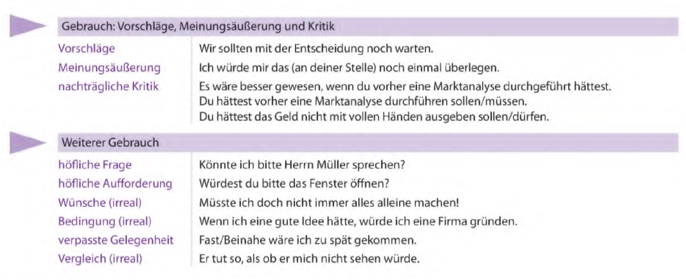
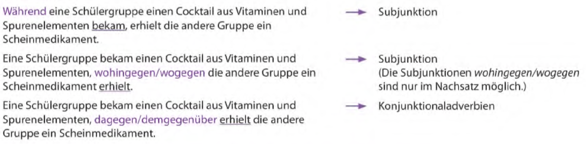
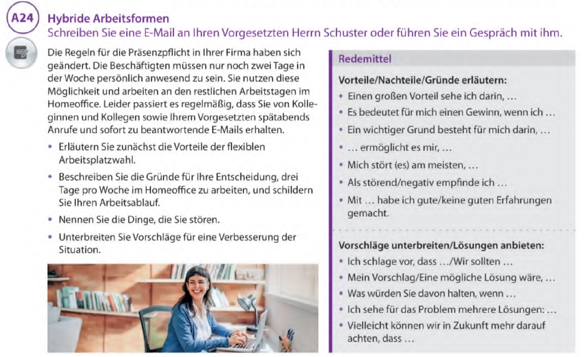
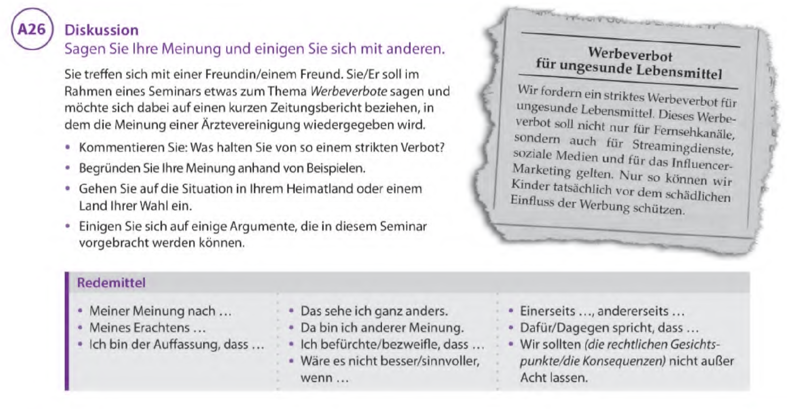

# C1 – Fachkundige Sprachverwendung

**Themen:**
- Berufliche und akademische Themen
- Literatur und Kunst
- Technologische Innovationen
- Gesellschaftliche Probleme und Lösungen
- Medien und ihre Rolle in der Gesellschaft
- Philosophie und Ethik
- Globale Herausforderungen
- Kritisches Denken und Argumentation

**Grammatik:**
- Konjunktiv II in der Vergangenheit
- Gerundium und Infinitiv
- Nominalisierung komplexer Sätze
- Gebrauch von Modalverben in der Vergangenheit
- Reflexive Verben in der Vergangenheit und Zukunft
- Varianten im Satzbau und der Wortstellung
- Adjektive und deren Verwendung in verschiedenen Kontexten

---

## Redepartikeln

## Adjektive aus Verb + Präposition

- Die Studierenden sollten anhand von fotografierten Gesichtsausdrücken die *dazugehörige Emotion* ermitteln
- ...*daraus resultierend*...
- ...*darauf basierend*...
- ...*davon abhängig*
- ...*damit verbunden*..
- ...*daran orientiert*
- ...*darin bestehen*..

## Die Weitergabe von Informationen und Gerüchten

- **Beispiele:**
	- Die Nationalmannschaft hat sich im Höhentrainingslager in der Schweiz auf den Wettkampf vorbereitet
		- Die Nationalmanschaft *soll* sich im Höhentrainingslager in der Schweiz auf den Wettkampf *vorbereitet haben*
	- Wegen des Streits ist der Cheftrainer zurückgetreten
		- Wegen des Streits *soll* der Cheftrainer *zurückgetreten sein*
	- Die Trainingsbedingungen waren schwierig
		- Die Trainingsbedingungen *sollen* schwierig *gewesen sein*
	- Das Eröffnungsspiel findet in der neuen Arena statt
		- Das Eröffnungsspiel *soll* in der neuen Arena stattfinden
	- Das Stadion wird erst eine Woche vor dem Spiel fertig
		- Der Ausbau der Arena *soll* bis jetzt schon 25 Millionen Euro *gekostet haben*
	- „Ich habe den ganzen Winter in Italien hart trainiert
		- Er *will* den ganzen Winter in Italien hart *trainiert haben*
	- „Bei den Dopingkontrollen war ich zufällig krank"
		- Bei den Dopingkontrollen *will* er zufällig kran *gewesen sein*
	- „Ich kenne dieses leistungssteigernde Mittel überhaupt nicht"
		- Er *will* dieses leistungssteigernde Mittel überhaupt nicht kennen

## Konjunktiv II: Wiederholung

## Vermutungen ausdrücken: Wiederholung

## Adversativangaben: Wiederholung

## Besonderen Attributen

- Eine *zuckersüße* Limonade
- Ein *knallgelbes* Auto
- Eine *felsenfeste* Überzeugung
- Eine *knallharte* Verhandlung
- Ein *spindeldürres* Model
- Ein *bildschönes* Kleid
- *Spottbillige* Produkte
- Ein *stockdunkler* Raum
- Ein *steinreicher* Onkel
- *Pechschwarze* Haare
- *Nagelneue* Schuhe
- Eine *federleichte* Decke
- Ein *todsicherer* Tipp

---
## Redemitteln
### Über Forschungsergebnisse berichten

### Mündlicher Ausdruck

### Lachen und Lustiges

## Zweiteilige Satzverbindungen

---

## Schriftliche und mündliche Übungen

C1 Schreiben - https://www.youtube.com/watch?v=I_ThwTQ58pE

---
## Prüfungsvorbereitung
### Schreiben

#### Teil 1 - Forumsbeitrag

- *Einleitung / Meinung äußern*
	- In der heutigen Gesellschaft wird zunehmend darüber diskutiert, ob ...
	- Das Thema ... gewinnt immer mehr an Bedeutung
	- In den letzten Jahren hat sich die Frage gestellt, ob ...
	- Meiner Ansicht nach …
	- Es lässt sich nicht leugnen, dass …
	- Aus meiner Perspektive …
	- Einleitend könnte man sagen, dass ...
- *Argumentation / Begründung*
	- *Argumente einführen*
		- Dies lässt sich dadurch erklären, dass …
		- Ein entscheidender Aspekt ist …
		- Hinzu kommt, dass …
		- Ein häufig gennantes Argument dafür/dagegen ist, dass ...
		- Befürworter/Kritiker sind der Ansicht, dass ...
		- Ein weiterer Aspekt, der berücksichtigt werden sollte, ist ...
		- An erster Stelle steht, dass ...
	- *Beispiele hinzufügen*
		- Dies lässt sich am Beispiel von ... verdeutlichen
		- Besonders deutlich wird dies daran, dass ...
		- Ein gutes Beispiel ist ...
		- Eine sinnvolle Alternative ist ...
		- Auf diese Weise kann ohne Zweifel davon ausgegangen werden, dass ...
- *Übergänge und Verknüpfungen*
	- Einerseits ... andererseits ...
	- Zwar ... jedoch ...
	- Darüber hinaus ...
	- Nicht zu unterschätzen ist außerdem ...
	- Eher ... als
- *Eigene Meinung äußern*
	- Meiner Meinung nach ist festzuhalten, dass ...
	- Ich bin der Auffassung, dass ...
	- Aus meiner Sicht überwiegen die Vorteile/Nachteile, da ...
- *Meinung verstärken*
	- Besonders hervorzuheben ist …
	- Es ist von zentraler Bedeutung, dass …
- *Einschränken und Abwägen*
	- Im Gegensatz dazu …
	- Während …, gilt für …
	- Einerseits …, andererseits …
	- Allerdings darf nicht außer Acht gelassen werden, dass ...
	- Trotz dieser Vorteile ist zu berücksichtigen, dass ...
	- Dennoch ist festzustellen, dass ...
- *Folgerung / Schluss*
	- Daraus ergibt sich, dass …
	- Folglich …
	- Abschließend lässt sich sagen
		- , dass …
		- : ...
	- Zusammenfasend lässt sich sagen, dass ...
	- Abschließend kann festgehalten werden, dass ...
	- In zukunft wäre es wünschenswert, dass ...
