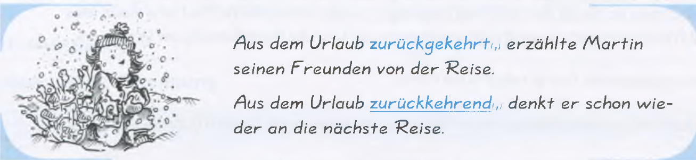

# C1 – Fachkundige Sprachverwendung

**Themen:**
- Berufliche und akademische Themen
- Literatur und Kunst
- Technologische Innovationen
- Gesellschaftliche Probleme und Lösungen
- Medien und ihre Rolle in der Gesellschaft
- Philosophie und Ethik
- Globale Herausforderungen
- Kritisches Denken und Argumentation

**Grammatik:**
- Konjunktiv II in der Vergangenheit
- Gerundium und Infinitiv
- Nominalisierung komplexer Sätze
- Gebrauch von Modalverben in der Vergangenheit
- Reflexive Verben in der Vergangenheit und Zukunft
- Varianten im Satzbau und der Wortstellung
- Adjektive und deren Verwendung in verschiedenen Kontexten

---

## Redepartikeln: Wiederholung

## Artikel: Wiederholung

derselbe = genau die gleiche Person oder Sache

- Beispiel:
	- Ich lese ein Buch.
	- Du liest dasselbe Buch.

Deklination:
|Kasus|	Maskulin|
|-|-|
|Nom.|	derselbe Mann|
|Akk.|	denselben Mann|
|Dat.|	demselben Mann|
|Gen.|	desselben Mannes|

|Kasus|	Feminin|
|-|-|
|Nom.|	dieselbe Frau|
|Akk.|	dieselbe Frau|
|Dat.|	derselben Frau|
|Gen.|	derselben Frau|

|Kasus|	Neutral|
|-|-|
|Nom.|	dasselbe Kind|
|Akk.|	dasselbe Kind|
|Dat.|	demselben Kind|
|Gen.|	desselben Kindes|

## Adjektive aus Verb + Präposition

- Die Studierenden sollten anhand von fotografierten Gesichtsausdrücken die *dazugehörige Emotion* ermitteln
- ...*daraus resultierend*...
- ...*darauf basierend*...
- ...*davon abhängig*
- ...*damit verbunden*..
- ...*daran orientiert*
- ...*darin bestehen*..

## Die Weitergabe von Informationen und Gerüchten

- **Beispiele:**
	- Die Nationalmannschaft hat sich im Höhentrainingslager in der Schweiz auf den Wettkampf vorbereitet
		- Die Nationalmanschaft *soll* sich im Höhentrainingslager in der Schweiz auf den Wettkampf *vorbereitet haben*
	- Wegen des Streits ist der Cheftrainer zurückgetreten
		- Wegen des Streits *soll* der Cheftrainer *zurückgetreten sein*
	- Die Trainingsbedingungen waren schwierig
		- Die Trainingsbedingungen *sollen* schwierig *gewesen sein*
	- Das Eröffnungsspiel findet in der neuen Arena statt
		- Das Eröffnungsspiel *soll* in der neuen Arena stattfinden
	- Das Stadion wird erst eine Woche vor dem Spiel fertig
		- Der Ausbau der Arena *soll* bis jetzt schon 25 Millionen Euro *gekostet haben*
	- „Ich habe den ganzen Winter in Italien hart trainiert
		- Er *will* den ganzen Winter in Italien hart *trainiert haben*
	- „Bei den Dopingkontrollen war ich zufällig krank"
		- Bei den Dopingkontrollen *will* er zufällig kran *gewesen sein*
	- „Ich kenne dieses leistungssteigernde Mittel überhaupt nicht"
		- Er *will* dieses leistungssteigernde Mittel überhaupt nicht kennen

## Konjunktiv II

Wünsche ausdrücken:
- Hätte ich doch mehr Zeit!
- Wäre ich doch früher gekommen!
- Könnte ich doch fließend Deutsch sprechen!
- Müsste ich doch nicht so viel arbeiten!

Folgende Verben sollen mit der klassichen Konjunktiv-II-Form verwendet werden, um ein gehobenes Ausdrück zu erzielen:

- gehen → ginge
- kommen → käme
- finden → fände
- geben → gäbe
- sehen → sähe
- nehmen → nähme
- stehen → stünde
- bleiben → bliebe
- fahren → führe
- tragen → trüge
- sprechen → spräche
- treffen → träfe
- beginnen → begänne
- wissen → wüsste
- lassen → ließe

### Irrealer Konsekutivsatz

Die irrealen Konsekutivsätze werden mit **als dass** oder **dass** eingeleitet und drücken eine Folge aus. Diese Folge tritt aber nicht ein wegen des zu großen oder zu niedrigen Maßes eines Umstands, der im Hauptsatz umschrieben wird.

Das zu große oder zu niegrige Maß wird im Hauptsatz mit Ausdrücken wie zu, nicht genug, so, nicht so usw. ausgedrückt.

**Struktur:** zu + Adjektiv + als dass + Konjunktiv II

**Beispiele:**
- Ich aß so viel, dass ich beinahe geplatzt wäre.
- Das Wasser ist nicht warm genug, als dass man im Meer baden könnte.
- Das Erlernen der deutschen Sprache ist zu schwierig, als dass man noch Zeit für ausreichend Schlaf hätte
- Die Aufgabe war zu schwierig, als dass sie sie hätte lösen können.
- Er war zu stolz, als dass er um Hilfe gebeten hätte.
- Das Problem ist zu komplex, als dass man es in einer Stunde lösen könnte.

**Beispiele:**
- Die Daten wurden so lückenhaft erhoben, dass daraus keine belastbaren Schlussfolgerungen gezogen werden können.
  - Die Daten wurden zu lückenhaft erhoben, als dass daraus belastbaren Schlussfolgerungen gezogen werden könnten
  - Die Daten wurden zu lückenhaft erhoben, als dass sich daraus belastbare Schlussfolgerungen ziehen ließen
- Der Vorschlag war so unausgereift, dass er vom Ausschuss nicht verabschiedet werden konnte
  - Der Vorschlag war so unausgereift, als dass er vom Ausschuss hätte vearbschiedet werden können
- Die Rahmenbedingungen waren so ungünstig, dass das Vorhaben nicht erfolgreich umgesetzt werden konnte.
  - Die Rahmenbedingungen waren zu ungünstig, als dass das Vorhaben erfolgreich hätte umgesetzt werden können.
- Der Eingriff wäre so riskant gewesen, dass ihn kein verantwortungsvoller Arzt durchgeführt hätte
  - Der Eingriff wäre zu riskant gewesen, als dass ein verantwortungsvoller Arzt ihn hätte durchführen können.
  - Der Eingriff wäre zu riskant gewesen, als dass ein verantwortungsvoller Arzt ihn in Betracht gezogen hätte.

Diese Konstruktion klingt deutlich gehobener als:
- ... sodass ...
- ... deshalb konnte ...

## Vermutungen ausdrücken: Wiederholung

## Adversativangaben: Wiederholung

## Besonderen Attributen

- Eine *zuckersüße* Limonade
- Ein *knallgelbes* Auto
- Eine *felsenfeste* Überzeugung
- Eine *knallharte* Verhandlung
- Ein *spindeldürres* Model
- Ein *bildschönes* Kleid
- *Spottbillige* Produkte
- Ein *stockdunkler* Raum
- Ein *steinreicher* Onkel
- *Pechschwarze* Haare
- *Nagelneue* Schuhe
- Eine *federleichte* Decke
- Ein *todsicherer* Tipp

## Adjektivdeklination: Wiederholung

- **Solche**
  - Falsch
    - Mit solchem bemerkenswerten Kandidaten würde ich sofort zusammenarbeiten.
  - Richtig
    - Mit **einem** solchen bemerkenswerten Kandidaten würde ich sofort zusammenarbeiten.

## Indirekte Rede: Wiederholung

- Nach Aussagen des Vorstandsvorsitzenden sei die Dividendenpolitik langfristig angelegt
- Der Vorstandsvorsitzende berichtete außerdem, dass sich die gute Entwicklung der letzten Jahre auch in diesem Geschäftsjahr fortsetze
- Auch in anderen Bereichen hätten sich Anzeichen für Fortschritte gezeigt, zum Beispiel bei der Bekämpfung
der Luftverschmutzung
- Durch den gestiegenen CO2-Preis in der EU sei vor allem die Kohleproduktion teurer geworden

## Imperativ: Wiederholung

## Nominalisierung: Wiederholung

- *Um sich vor Grippe zu schützen*, kann man sich impfen lassen
  - Zum Schutz vor Grippe, kann man sich impfen lassen
- Die Zahlung wird fällig, *wenn wir die Waren liefern*
  - Die Zahlung wird bei Lieferung der Waren fällig
- Jetzt muss du die Aufgaben aber mal lösen, *ohne dass ich dir dabei helfe*
  - Jetzt muss du die Aufgaben aber mal ohne meine Hilfe lösen
- Du hättest deine Finanzen mal überprüfen sollen, *bevor du dir eine Eigentumswohnung kaufst*
  - Du hättest deine Finanzen mal vor dem Kauf einer Eigentumswohnung überprüfen sollen
- Die Firma muss ihre Umsätze steigern, *damit alle Arbeitsplätze erhalten bleiben können*
  - Die Firma muss ihre Umsätze zum / für den Erhalt aller Arbeitsplätze steigern
- *Soweit ich informiert bin*, beginnt das nächste Semester erst Anfang Oktober
  - Nach meiner Information, beginnt das nächste Semester erst Anfang Oktober
- Ich hatte genügend Geld bei mir, *was ein großes Glück für mich war*
  - Ich hatte zum Glück genügend Geld bei mir
- *Obwohl die Regierung Maßnahmen ergriff*, hat sich die Lage noch nicht wesentlich verbessert
  - *Trozt der Ergreifung von Maßnahmen durch die Regierung*, hat sich die Lage noch nicht wesentlich verbessert
- Er konnte sein Können noch nicht unter Beweis stellen, *weil eine Gelegenheit dazu fehlte*
  - Er konnte sein Können aus Mangel an / mangels Gelegenheit noch nicht unter Beweis stellen

## Passiv und Passiversatzformen

- Leons Hemd ist total zerknittert
  - Das Hemd hätte gebügelt werden müssen
- Der Bibliothekausweis ist abgelaufen
  - Der Bibliothekausweis hätte verlängert werden müssen
- Die Daten sin unvollständig
  - Die Daten hätten ergänzt werden müssen
- Der Drucker ist kaputt 
  - Der Drucker hätte repariert werden müssen

- Die Behörde antwortete mir nicht auf mein Schreiben
  - Mir wurde auf mein Schreiben von der Behörde nicht geantwortet
- Viele Firmen werben noch immer in Kindersendungen für Süßigkeiten
  - Es wird von vielen Firmen noch immer in Kindersendungen für Süßigkeiten geworben

- Bei der Razzia wurden auch zehn Polizeihunde eingesetzt
  - Bei der Razzia waren auch zehn Polizeihunde im Einsatz
- Die Qualität der Ware wird ständig kontrolliert
  - Die Qualität der Ware unterliegt ständiger Kontrollen
- Die Vorschläge der Architektinnen und Architekten werden auf der heutigen Stizung diskutiert
  - Die Vorschläge der Architektinnen und Architekten stehen auf der heutigen Sitzung zur Diskussion
- Die zu spät eingerichteten Entwürfe können nicht mehr berücksichtigt werden
  - Die zu spät eingerichteten Entwürfe können keine Berücksichtigung mehr finden
- Der Entwurf des Architektenteams aus Sachsen wurde heftig kritisiert
  - Der Entwurf des Architektenteams aus Sachsen stieß auf heftige Kritik
- Ende des Monats wird das Projekt abgeschlossen
  - Ende des Monats kommt das Projekt zum Abschluss
- Das Kunstwerk im Eingangsbereich wurde von allen beachtet
  - Dem Kuntswerk im Eingansbereich schenkten alle große Beachtung
- Einige der Künstler/-innen werden sicher schnell wieder vergessen
  - Einige der Künstler/-innen geraten sicher schnell wieder in Vergessenheit

## Nomen mit präpositionaler Ergänzung: Wiederholung

- Der Dichter hat eine Vorliebe für Gärten im englischen Stil
- Die anhaltende Finanzkrise bietet Anlass zur Sorge
- Der Klimawandel wird Folgen für spätere Generationen haben
- Viele kleine Firmen müssen einen Antrag auf Unterstützung bei den entsprechenden Stellen des Bundes stellen

## Besonderheiten im Numerus

## Verben mit Präfixen: Wiederholung

*Einige untrennbare Verben:*
- Hinterfragen
- Hintergehen
- Überweisen
- Übersetzen
  - Bedeutung aus einer Sprache ins andere übertragen
- Überspringen
- Überhören
- Unterstellen
  - Jmd. einen Vorwurf machen
- Umfahren
  - Etw. am Rand vorbeifahren
- Durchsuchen
- Durchschauen
- Wiederholen
- Widersprechen
- Widerrufen

## Partizipialsätze

*Relativsatz:* Martin, der aus dem Urlaub zurückgekehrt war, erzählte seinen Freunden von der Reise

*Adverbialsatz:* Als Martin aus dem Urlaub zurückgekehrt war, erzählte er seinen Freunden von der Reise

*Partizipialsatz:* Aus dem Urlaub zurückgekehrt(,) erzählte Martin seinen Freunden von der Reise

>[!Note]
>Partizipialsätze werden hauptsächlich in der Schriftsprache verwendet

*Formen:*
- Verkürzt Relativsatz
  - Aus dem Urlaub zurückgekehrt, erzählte Martin seinen Freunden von der Reise
- Bleibt die Subjunktion erhalten
  - *Obwohl* schon oft ausprobiert, funktionierte das Gerät bei der Vorführung nicht
- Feste Wendungen
  - Das Experiment, *kurz gesagt*, ist gescheitert
- Partzip I von haben und sein weglassen
  - Der Professor betrat, sein Manuskript in der Hand, das Podium

**Beispiele:**
- *Normal:*
  - Das Vorhaben wird, wenn man es grob schätzt, 50.000 Euro kosten
  - Die Maßnahmen sind, wenn man es langfristig sieht, nicht effektiv und wirkungsvoll genug
  - Obwohl er gerade geschult wurde, unterlaufen dem Projektleiter doch noch immer grobe Fehler
  - Obwohl die Präsentation gut vorbereitet war, scheiterte sie
  - Die Mitarbeiter, die an dem Projekt beteiligt sind, erhalten eine Prämie
- *Partizipialkonstruktion:*
  - Das Vorhaben wird, grob geschätzt, 50.000 Euro kosten
  - Die Maßnahmen sind, langfristig gesehen, nicht effektiv und wirkungsvoll genug
  - Obwohl gerade geschult, unterlaufen dem Projektleiter doch noch immer grobe Fehler
  - Gut vorbereitet, scheiterte die Präsentation dennoch
  - Die an dem Projekt beiteiligten Mitarbeiter erhalten eine Prämie

---

## Fokuspartikeln

Fokuspartikeln heben einen Teil des Satzes hervor.

**Sie beantworten indirekt die Frage:** Worauf genau soll die Aufmerksamkeit gelenkt werden?

### Additive Partikeln

Sie fügen etwas hinzu.

- *auch*
  - Ich spreche Deutsch. Ich spreche auch Französisch
- *Ebenfalls* (Formeller als "auch")
  - Der Kunde hat sich beschwert.
  - Der Lieferant hat sich ebenfalls beschwert.
- *Zudem*
  - Das Produkt ist günstig.
  - Es ist zudem sehr zuverlässig.
- *Sogar* (Die Überraschungspartikel)
  -   Alle haben bestanden.
  - Sogar Peter hat bestanden.
- *Selbst*
  - Fast wie "sogar".
  - Selbst Experten machen Fehler.

### Restriktive Partikeln

- *Nur*
  - Ich habe nur zehn Euro.
- *Bloß* (Umgangssprachlicher)
  - Bloß nichts vergessen!
- *Lediglich* (formeller)
  - Die Reparatur dauerte lediglich zwei Stunden.
- *Allein*
  - Allein die Vorbereitung dauerte drei Wochen.

### Andere Partikeln

- *Durchaus*
  - Das ist durchaus möglich.
  - Sein Argument ist durchaus überzeugend.
- *Keineswegs*
  - Das ist keineswegs selbstverständlich.
- *Gerade*
  - Gerade dieser Punkt ist entscheidend.
- *Ausgerechnet*
  - Ausgerechnet Heinrich der Dritte...  
- *Insbesondere*
  - Besonders wichtig sind insbesondere die Sicherheitsaspekte.

### Graduierende Partikeln

- *Erst*
  - Es ist erst acht Uhr = überraschend früh
- *Schon*
  - Es ist schon acht Uhr = überraschend spät
- *Bereits* (formeller)
- *Immerhin*
  - Die Prüfung war schwer. Immerhin habe ich bestanden.
- *Wenigstens*
  - Wenigstens war das Essen gut.
- *Zumindest* (Etwas vorsichtiger als „wenigstens“.)
  - Zumindest theoretisch ist das möglich.

### Positionswechsel

- Auch Daniel spricht Deutsch.
  - Daniel zusätzlich zu anderen Personen.
- Daniel spricht auch Deutsch.
  - Deutsch zusätzlich zu anderen Sprachen.
- Nur Daniel bestand die Prüfung.
  - Niemand sonst.
- Daniel bestand nur die Prüfung.
  - Er bestand die Prüfung, aber nichts anderes.
- Daniel bestand die Prüfung nur knapp.
  - Jetzt beschreibt „nur“ den Grad.

## Nebensatzkonnektoren

- *Insofern als*
  - Die Maßnahme war erfolgreich, insofern als die Kosten reduziert werden konnten.
- *Sofern nicht*
- *Gesetzt den Fall, dass ...*
  - Gesetzt den Fall, dass die Verhandlungen scheitern, müsste eine Alternative gefunden werden.
- *Vorausgesetzt, dass ...*
  - Vorausgesetzt, dass alle Unterlagen vorliegen, kann der Prozess gestartet werden.
- *Unter der Bedingung, dass ...*
  - Unter der Bedingung, dass sich die Lage nicht verschlechtert, wird das Projekt fortgeführt.
- *Zumal*
  - Man sollte den Vorschlag unterstützen, zumal es keine bessere Alternative gibt.
- *Wohingegen*
  - Die Exporte stiegen deutlich an, wohingegen die Importe zurückgingen.
- *Soweit* / *Sofern* / *In dem Maß, in dem ...*
  - Soweit ich informiert bin, wurde noch keine Entscheidung getroffen.
- *Obgleich*
  - Obgleich zahlreiche Probleme bekannt waren, wurde das Projekt gestartet.
- *Ungeachtet dessen, dass*
  - Ungeachtet dessen, dass Einwände erhoben wurden, blieb die Entscheidung bestehen.
- *Anstatt das ...*
  - Anstatt dass die Situation verbessert wird, verschärft sie sich zunehmend.
- *Ehe*
  - Ehe man eine Entscheidung trifft, sollten alle Fakten geprüft werden.
- *Alldieweil*
  - Alldieweil die Ressourcen knapp waren, musste priorisiert werden.

## Weiterführende Relativsätze

- **Normal:**
  - Er hat die Prüfung bestanden. Das freut mich.
- **Eleganter:**
  - Er hat die Prüfung bestanden, was mich sehr freut.

- **Weitere Beispiele:**
  - Die Firma machte hohe Gewinne, was niemand erwartet hatte.
  - Das ist das beste, was mir hätte passieren können  
  - Sie kündigte plötzlich, womit viele überrascht waren.
  - Die Prozesse wurden automatisiert, wodurch die Kosten gesenkt werden konnten.
  - Die Umsätze stiegen deutlich, wobei insbesondere der Online-Handel profitierte.
  - Das Projekt wurde verschoben, weshalb/weswegen sich der Zeitplan änderte.
  - Der Konzern erhöhte die Preise, woraufhin die Nachfrage zurückging.
  - Die Regierung beschloss neue Maßnahmen, worüber in den Medien intensiv diskutiert wurde.
  - Viele Bürger befürworten die Reform, wogegen sich einige Interessengruppen entschieden aussprechen.
  - Das Projekt scheiterte letztlich, woran mehrere Faktoren beteiligt waren.

## Umschreibungen für Modalverben

Extrem häufig in formellen E-Mails.
Statt:
Kann ich...?
Verwendet man:
Wäre es möglich ...
Ich würde gerne ...
Gestatten Sie mir ...
Ich wäre Ihnen dankbar, wenn ...
Es besteht die Möglichkeit ...
Statt:
Sie müssen ...
Schreibt man:
Sie sind verpflichtet ...
Es ist erforderlich ...
Es gilt ...
Es bedarf ...

## Zweiteilige Präpositionen

*Auf* deinen Hinweis *hin* habe ich mich direkt zum C1-Kurs angemeldet

*Über* die Jahre *hinweg* habe ich mich immer mehr und mehr in die deutsche Sprache verliebt

Diese tauchen häufig auf.
Beispiele:
auf ... hin
über ... hinweg
von ... aus
mit Blick auf
im Hinblick auf
Beispiel:
Auf seinen Rat hin wechselte ich die Arbeitsstelle.
Über die Jahre hinweg hat sich mein Deutsch verbessert.

## Sprechende Präpositionen

Sehr fortgeschritten.
Wichtige Vertreter:
zugunsten
zuliebe
angesichts
ungeachtet
hinsichtlich
betreffs
diesseits
jenseits
Beispiele:
Angesichts der Situation mussten wir handeln.
Die Entscheidung fiel zugunsten des Kunden aus.
Ihren Kindern zuliebe zog die Familie um.

Wir verbringen den Kindern *zuliebe* jeden Nachmittag auf dem Spielplatz

Bei einem Familienrechtsstreit entscheiden die Richter oft *zugunsten* der Kinder

## Passiversatzformen

Sehr häufig in formellen Texten.
Passiv:
Das Zertifikat wird überreicht.
Passiversatz:
Das Zertifikat erhält die Schülerin überreicht.
Das Zertifikat ist zu überreichen.
Das Zertifikat lässt sich leicht erstellen.
Das Zertifikat gilt als erstellt.

Die Schülerin *erhält* das Zertifikat *überreicht*

## Aktivische vs. passivische Nomen-Verb-Verbindungen
Du kennst schon einige.
Aktivisch:
eine Entscheidung treffen
Maßnahmen ergreifen
Kritik üben
Passivisch:
zur Entscheidung kommen
in Vergessenheit geraten
außer Kontrolle geraten
aus dem Konzept geraten
Dazu könnte man problemlos 100 weitere Verbindungen lernen.

aus dem Konzept bringen = jmd. verwirren
aus dem Konzept geraten

## Kommasetzung

ICH BEREUE(,) ES NICHT EHER GETAN ZU HABEN.

## Umgangssprache

Typische Beispiele:
Willste?
Haste?
Kommste mit?
'nen Kaffee
läuft bei dir

WILLSTE ‘NEN KAFFEE?

---

## Redemitteln
### Über Forschungsergebnisse berichten

### Mündlicher Ausdruck

### Lachen und Lustiges

### Zweiteilige Satzverbindungen

### Über eine Wahl berichten

### Gefallen/Missfallen ausdrücken

## Ratschläge geben

---

## Schriftliche und mündliche Übungen

C1 Schreiben - https://www.youtube.com/watch?v=I_ThwTQ58pE

-----------------------------------------------------------------

## Sich bewerben

### Das Anschreiben

#### Formulierungstipps und Vorlagen

### Der Lebenslauf

--------------------------------------------------------------------

## Jobs suchen durch Netzwerken

- https://www.spinnen-netz.de/content/diversitaetsorientierte-personalgewinnung
- https://wusgermany.de/de
- www.jugendmigrationsdienste.de (bis 27)
- Migrationsberatung für Erwachsene (MBE) (+27)
- https://www.damigra.de/ (Dachverband der Migrantinnenorganisationen)
- https://www.frnrw.de/ (Flüchtlingsrat in NWR - Such je nach Bundesland)
- https://nebenan.de/
- Volkshochschule Organisation - Lernen- und Kulturangebote
- https://www.vdi.de/mitgliedschaft/nachwuchs/zukunftspiloten
- www.kmk.org (Anerkennungsberatung)
- https://www.make-it-in-germany.com/de/arbeiten-in-deutschland/anerkennung

