# C1 – Fachkundige Sprachverwendung

**Themen:**
- Berufliche und akademische Themen
- Literatur und Kunst
- Technologische Innovationen
- Gesellschaftliche Probleme und Lösungen
- Medien und ihre Rolle in der Gesellschaft
- Philosophie und Ethik
- Globale Herausforderungen
- Kritisches Denken und Argumentation

**Grammatik:**
- Konjunktiv II in der Vergangenheit
- Gerundium und Infinitiv
- Nominalisierung komplexer Sätze
- Gebrauch von Modalverben in der Vergangenheit
- Reflexive Verben in der Vergangenheit und Zukunft
- Varianten im Satzbau und der Wortstellung
- Adjektive und deren Verwendung in verschiedenen Kontexten

---

## Redepartikeln: Wiederholung

## Artikel: Wiederholung

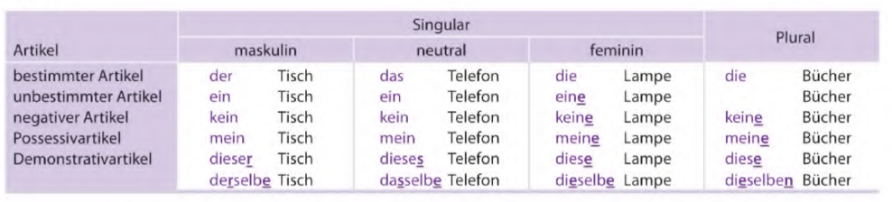

## Adjektive aus Verb + Präposition

- Die Studierenden sollten anhand von fotografierten Gesichtsausdrücken die *dazugehörige Emotion* ermitteln
- ...*daraus resultierend*...
- ...*darauf basierend*...
- ...*davon abhängig*
- ...*damit verbunden*..
- ...*daran orientiert*
- ...*darin bestehen*..

## Die Weitergabe von Informationen und Gerüchten

- **Beispiele:**
	- Die Nationalmannschaft hat sich im Höhentrainingslager in der Schweiz auf den Wettkampf vorbereitet
		- Die Nationalmanschaft *soll* sich im Höhentrainingslager in der Schweiz auf den Wettkampf *vorbereitet haben*
	- Wegen des Streits ist der Cheftrainer zurückgetreten
		- Wegen des Streits *soll* der Cheftrainer *zurückgetreten sein*
	- Die Trainingsbedingungen waren schwierig
		- Die Trainingsbedingungen *sollen* schwierig *gewesen sein*
	- Das Eröffnungsspiel findet in der neuen Arena statt
		- Das Eröffnungsspiel *soll* in der neuen Arena stattfinden
	- Das Stadion wird erst eine Woche vor dem Spiel fertig
		- Der Ausbau der Arena *soll* bis jetzt schon 25 Millionen Euro *gekostet haben*
	- „Ich habe den ganzen Winter in Italien hart trainiert
		- Er *will* den ganzen Winter in Italien hart *trainiert haben*
	- „Bei den Dopingkontrollen war ich zufällig krank"
		- Bei den Dopingkontrollen *will* er zufällig kran *gewesen sein*
	- „Ich kenne dieses leistungssteigernde Mittel überhaupt nicht"
		- Er *will* dieses leistungssteigernde Mittel überhaupt nicht kennen

## Konjunktiv II: Wiederholung

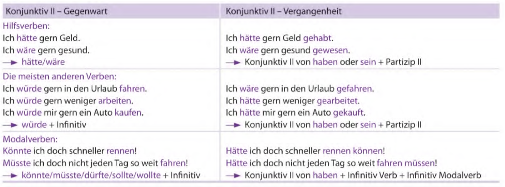

## Vermutungen ausdrücken: Wiederholung

## Adversativangaben: Wiederholung

## Besonderen Attributen

- Eine *zuckersüße* Limonade
- Ein *knallgelbes* Auto
- Eine *felsenfeste* Überzeugung
- Eine *knallharte* Verhandlung
- Ein *spindeldürres* Model
- Ein *bildschönes* Kleid
- *Spottbillige* Produkte
- Ein *stockdunkler* Raum
- Ein *steinreicher* Onkel
- *Pechschwarze* Haare
- *Nagelneue* Schuhe
- Eine *federleichte* Decke
- Ein *todsicherer* Tipp

## Adjektivdeklination: Wiederholung

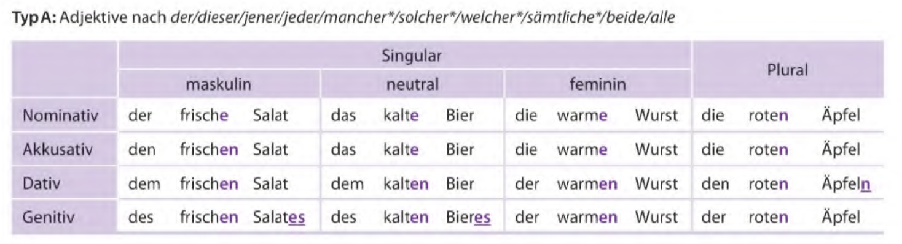
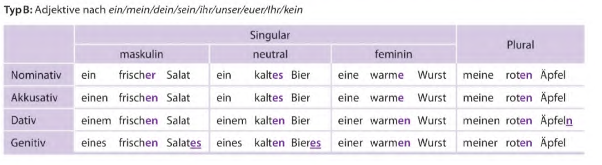
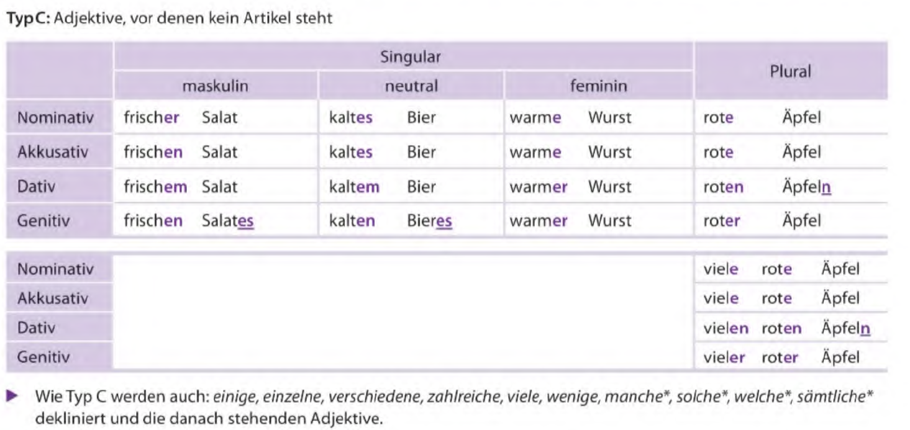

## Indirekte Rede: Wiederholung

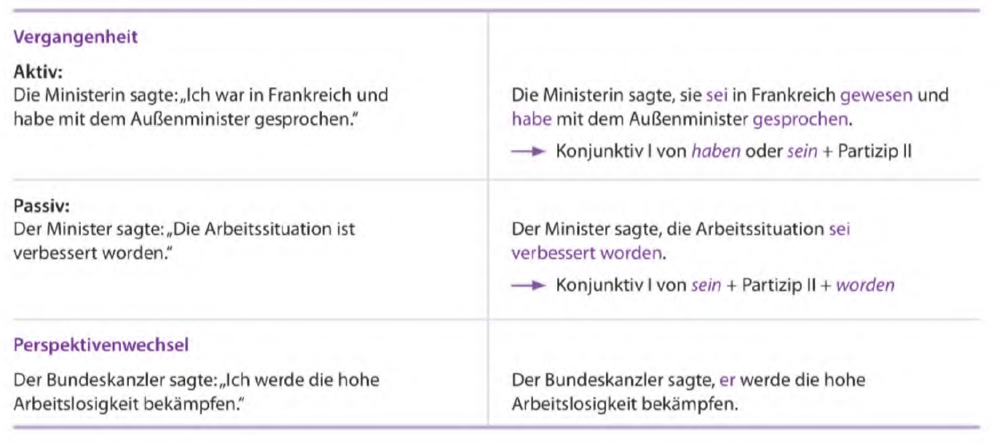

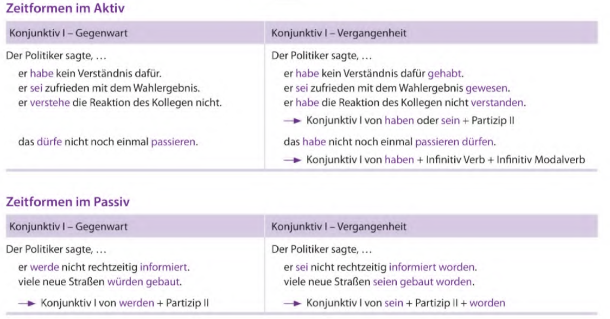

- Nach Aussagen des Vorstandsvorsitzenden sei die Dividendenpolitik langfristig angelegt
- Der Vorstandsvorsitzende berichtete außerdem, dass sich die gute Entwicklung der letzten Jahre auch in diesem Geschäftsjahr fortsetze
- Auch in anderen Bereichen hätten sich Anzeichen für Fortschritte gezeigt, zum Beispiel bei der Bekämpfung
der Luftverschmutzung
- Durch den gestiegenen CO2-Preis in der EU sei vor allem die Kohleproduktion teurer geworden

## Imperativ: Wiederholung

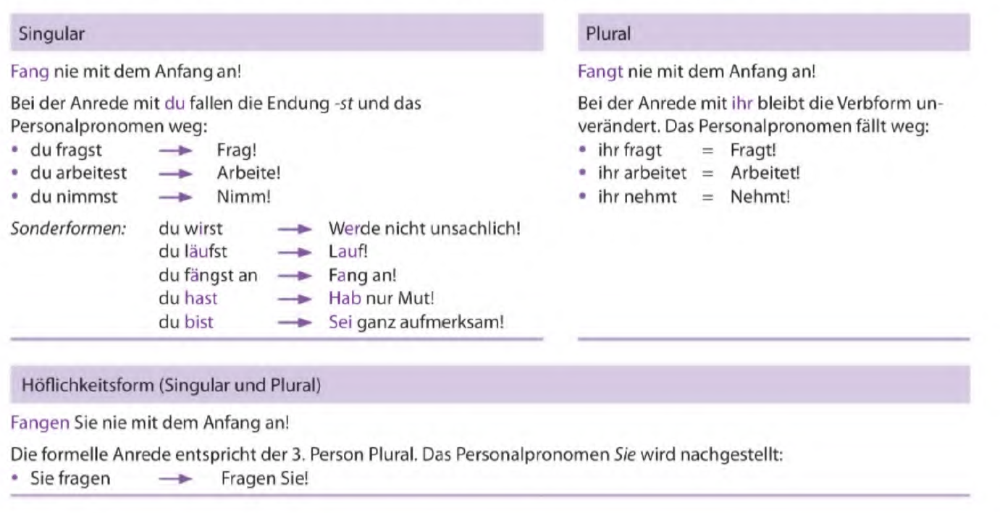

## Nominalisierung: Wiederholung

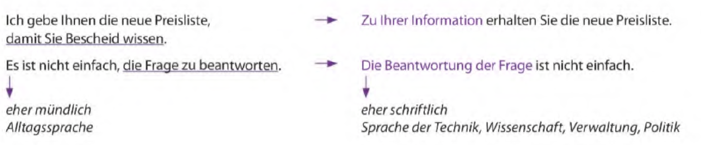

- *Um sich vor Grippe zu schützen*, kann man sich impfen lassen
  - Zum Schutz vor Grippe, kann man sich impfen lassen
- Die Zahlung wird fällig, *wenn wir die Waren liefern*
  - Die Zahlung wird bei Lieferung der Waren fällig
- Jetzt muss du die Aufgaben aber mal lösen, *ohne dass ich dir dabei helfe*
  - Jetzt muss du die Aufgaben aber mal ohne meine Hilfe lösen
- Du hättest deine Finanzen mal überprüfen sollen, *bevor du dir eine Eigentumswohnung kaufst*
  - Du hättest deine Finanzen mal vor dem Kauf einer Eigentumswohnung überprüfen sollen
- Die Firma muss ihre Umsätze steigern, *damit alle Arbeitsplätze erhalten bleiben können*
  - Die Firma muss ihre Umsätze zum / für den Erhalt aller Arbeitsplätze steigern
- *Soweit ich informiert bin*, beginnt das nächste Semester erst Anfag Oktober
  - Nach meiner Information, beginnt das nächste Semester erst Anfag Oktober
- Ich hatte genügend Geld bei mir, *was ein großes Glück für mich war*
  - Ich hatte zum Glück genügend Geld bei mir
- *Obwohl die Regierung Maßnahmen ergriff*, hat sich die Lage noch nicht wesentlich verbessert
  - *Trozt der Ergreifung von Maßnahmen durch die Regierung*, hat sich die Lage noch nicht wesentlich verbessert
- Er konnte sein Können noch nicht unter Beweis stellen, *weil eine Gelegenheit fazu fehlte*
  - Er konnte sein Können aus Mangel an / mangels Gelegenheit noch nicht unter Beweis stellen

## Passiv und Passiversatzformen

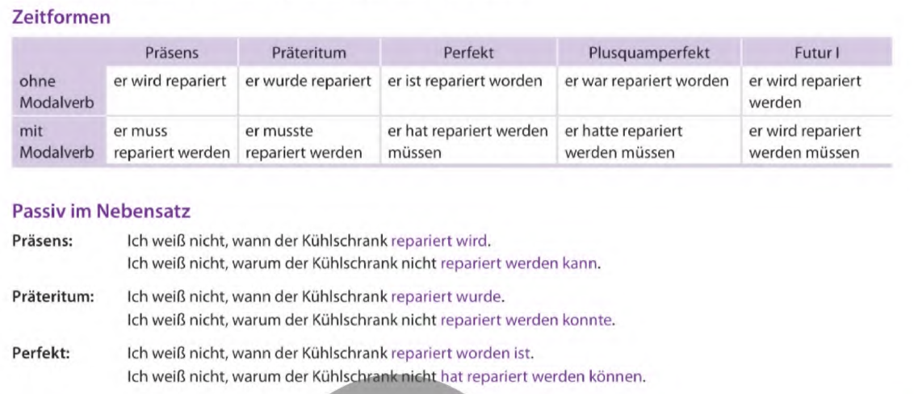

- Leons Hemd ist total zerknittert
  - Das Hemd hätte gebügelt werden müssen
- Der Bibliothekausweis ist abgelaufen
  - Der Bibliothekausweis hätte verlängert werden müssen
- Die Daten sin unvollständig
  - Die Daten hätten ergänzt werden müssen
- Der Drucker ist kaputt 
  - Der Drucker hätte repariert werden müssen

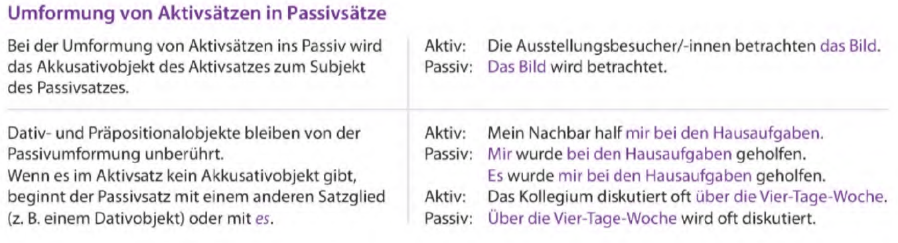

- Die Behörde antwortete mir nicht auf mein Schreiben
  - Mir wurde auf mein Schreiben von der Behörde nicht geantwortet
- Viele Firmen werben noch immer in Kindersendungen für Süßigkeiten
  - Es wird von vielen Firmen noch immer in Kindersendungen für Süßigkeiten geworben

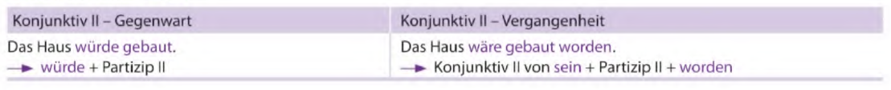

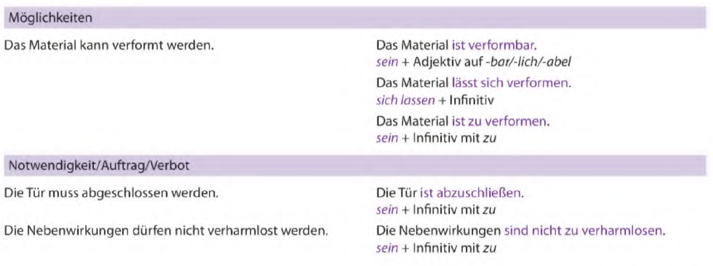
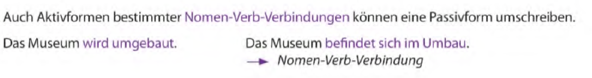

- Bei der Razzia wurden auch zehn Polizeihunde eingesetzt
  - Bei der Razzia waren auch zehn Polizeihunde im Einsatz
- Die Qualität der Ware wird ständig kontrolliert
  - Die Qualität der Ware unterliegt ständiger Kontrollen
- Die Vorschläge der Architektinnen und Architekten werden auf der heutigen Stizung diskutiert
  - Die Vorschläge der Architektinnen und Architekten stehen auf der heutigen Sitzung zur Diskussion
- Die zu spät eingerichteten Entwürfe können nicht mehr berücksichtigt werden
  - Die zu spät eingerichteten Entwürfe können keine Berücksichtigung mehr finden
- Der Entwurf des Architektenteams aus Sachsen wurde heftig kritisiert
  - Der Entwurf des Architektenteams aus Sachsen stieß auf heftige Kritik
- Ende des Monats wird das Projekt abgeschlossen
  - Ende des Monats kommt das Projekt zum Abschluss
- Das Kunstwerk im Eingangsbereich wurde von allen beachtet
  - Dem Kuntswerk im Eingansbereich schenkten alle große Beachtung
- Einige der Künstler/-innen werden sicher schnell wieder vergessen
  - Einige der Künstler/-innen geraten sicher schnell wieder in Vergessenheit

## Nomen mit präpositionaler Ergänzung: Wiederholung

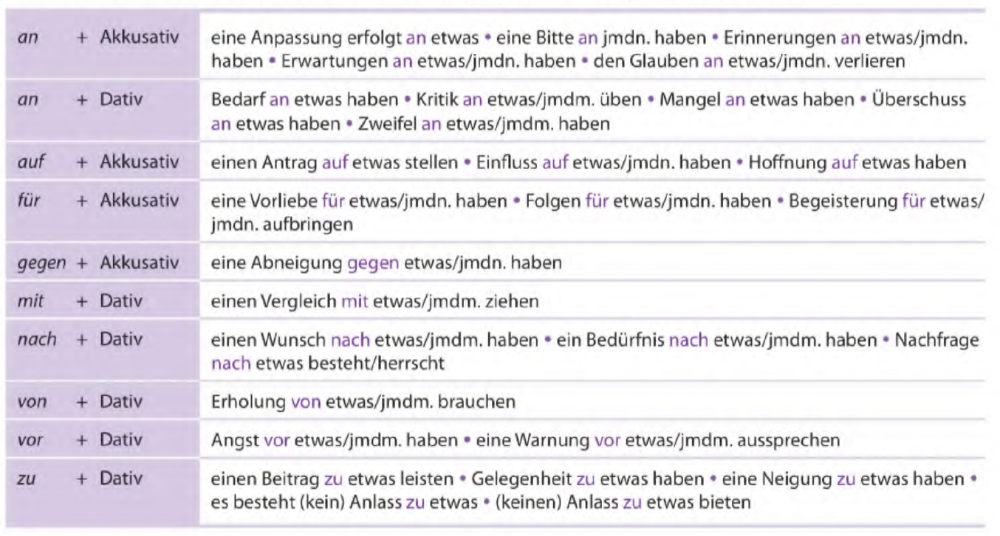

- Der Dichter hat eine Vorliebe für Gärten im englischen Stil
- Die anhaltende Finanzkrise bietet Anlass zur Sorge
- Der Klimawandel wird Folgen für spätere Generationen haben
- Viele kleine Firmen müssen einen Antrag auf Unterstützung bei den entsprechenden Stellen des Bundes stellen

## Besonderheiten im Numerus

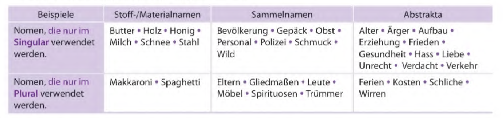

## Verben mit Präfixen: Wiederholung

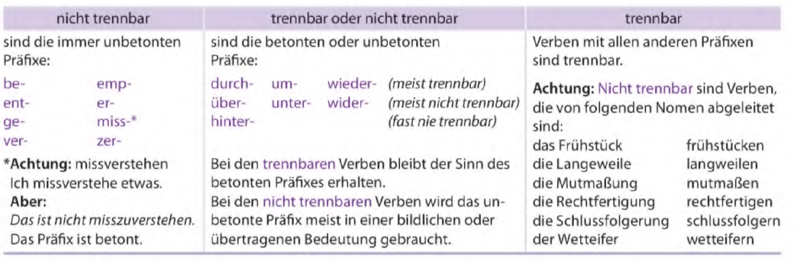

*Einige untrennbare Verben:*
- Hinterfragen
- Hintergehen
- Überweisen
- Übersetzen
  - Bedeutung aus einer Sprache ins andere übertragen
- Überspringen
- Überhören
- Unterstellen
  - Jmd. einen Vorwurf machen
- Umfahren
  - Etw. am Rand vorbeifahren
- Durchsuchen
- Durchschauen
- Wiederholen
- Widersprechen
- Widerrufen

---
## Redemitteln
### Über Forschungsergebnisse berichten

### Mündlicher Ausdruck

### Lachen und Lustiges

### Zweiteilige Satzverbindungen

### Über eine Wahl berichten

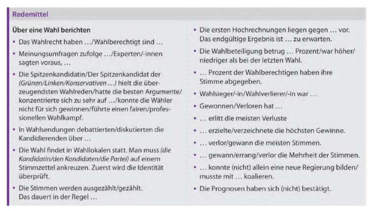

### Gefallen/Missfallen ausdrücken

## Ratschläge geben

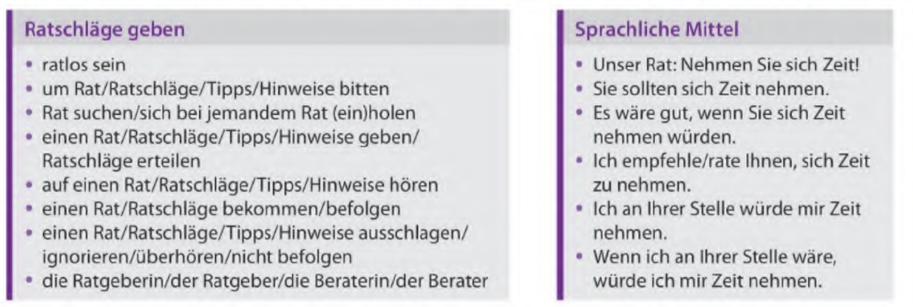

---

## Schriftliche und mündliche Übungen

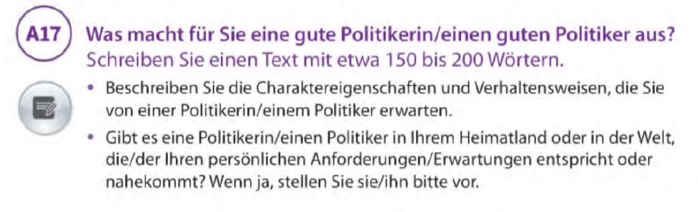

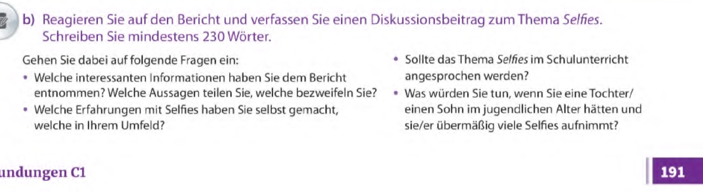

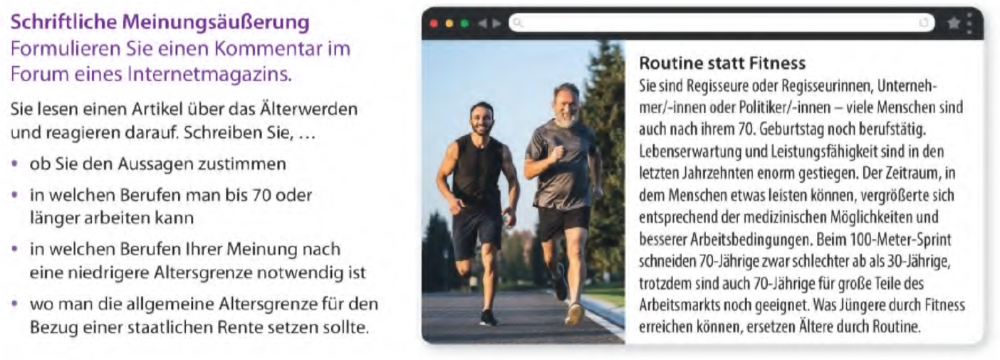

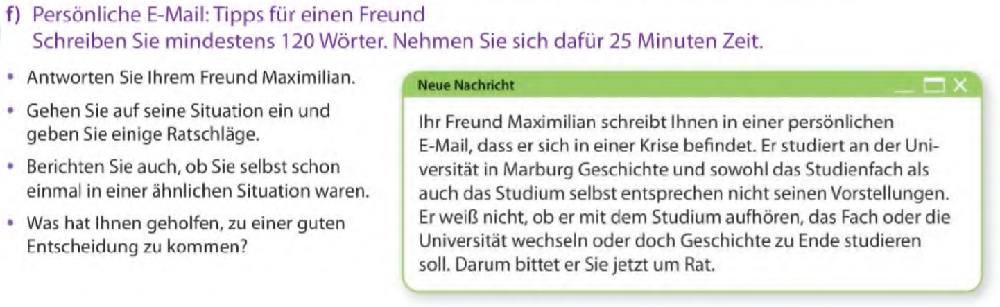

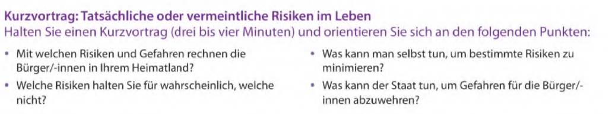

C1 Schreiben - https://www.youtube.com/watch?v=I_ThwTQ58pE

---
## Prüfungsvorbereitung
### Schreiben

#### Teil 1 - Forumsbeitrag

- *Einleitung / Meinung äußern*
	- In der heutigen Gesellschaft wird zunehmend darüber diskutiert, ob ...
	- Das Thema ... gewinnt immer mehr an Bedeutung
	- In den letzten Jahren hat sich die Frage gestellt, ob ...
	- Meiner Ansicht nach …
	- Es lässt sich nicht leugnen, dass …
	- Aus meiner Perspektive …
	- Einleitend könnte man sagen, dass ...
- *Argumentation / Begründung*
	- *Argumente einführen*
		- Dies lässt sich dadurch erklären, dass …
		- Ein entscheidender Aspekt ist …
		- Hinzu kommt, dass …
		- Ein häufig gennantes Argument dafür/dagegen ist, dass ...
		- Befürworter/Kritiker sind der Ansicht, dass ...
		- Ein weiterer Aspekt, der berücksichtigt werden sollte, ist ...
		- An erster Stelle steht, dass ...
	- *Beispiele hinzufügen*
		- Dies lässt sich am Beispiel von ... verdeutlichen
		- Besonders deutlich wird dies daran, dass ...
		- Ein gutes Beispiel ist ...
		- Eine sinnvolle Alternative ist ...
		- Auf diese Weise kann ohne Zweifel davon ausgegangen werden, dass ...
- *Übergänge und Verknüpfungen*
	- Einerseits ... andererseits ...
	- Zwar ... jedoch ...
	- Darüber hinaus ...
	- Nicht zu unterschätzen ist außerdem ...
	- Eher ... als
- *Eigene Meinung äußern*
	- Meiner Meinung nach ist festzuhalten, dass ...
	- Ich bin der Auffassung, dass ...
	- Aus meiner Sicht überwiegen die Vorteile/Nachteile, da ...
- *Meinung verstärken*
	- Besonders hervorzuheben ist …
	- Es ist von zentraler Bedeutung, dass …
- *Einschränken und Abwägen*
	- Im Gegensatz dazu …
	- Während …, gilt für …
	- Einerseits …, andererseits …
	- Allerdings darf nicht außer Acht gelassen werden, dass ...
	- Trotz dieser Vorteile ist zu berücksichtigen, dass ...
	- Dennoch ist festzustellen, dass ...
- *Folgerung / Schluss*
	- Daraus ergibt sich, dass …
	- Folglich …
	- Abschließend lässt sich sagen
		- , dass …
		- : ...
	- Zusammenfasend lässt sich sagen, dass ...
	- Abschließend kann festgehalten werden, dass ...
	- In zukunft wäre es wünschenswert, dass ...

-----------------------------------------------------------------

## Sich bewerben

### Das Anschreiben

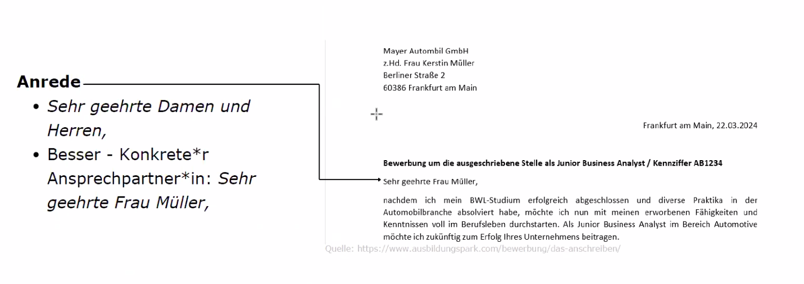
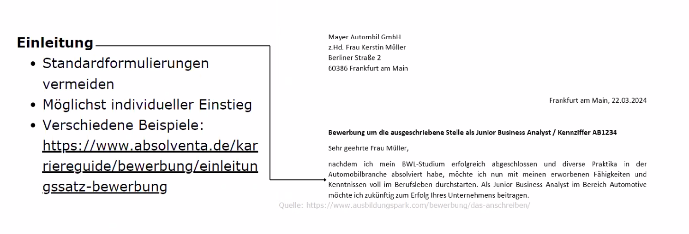
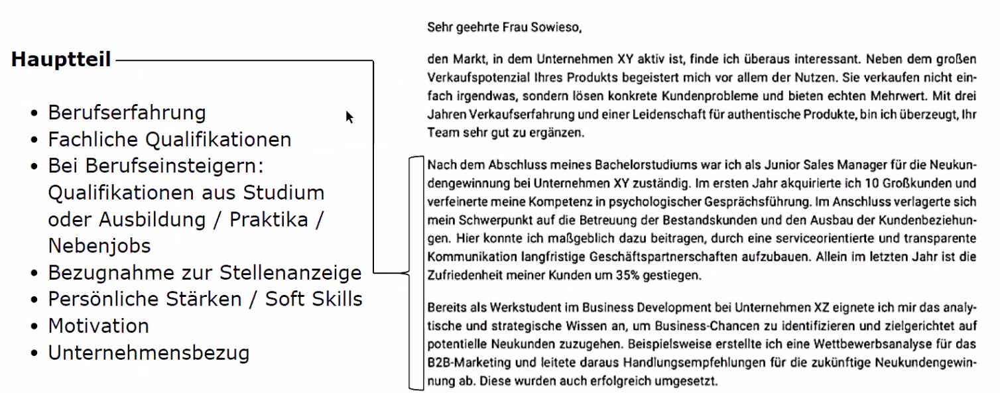
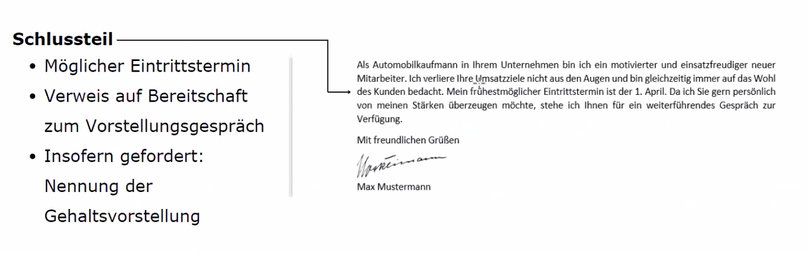
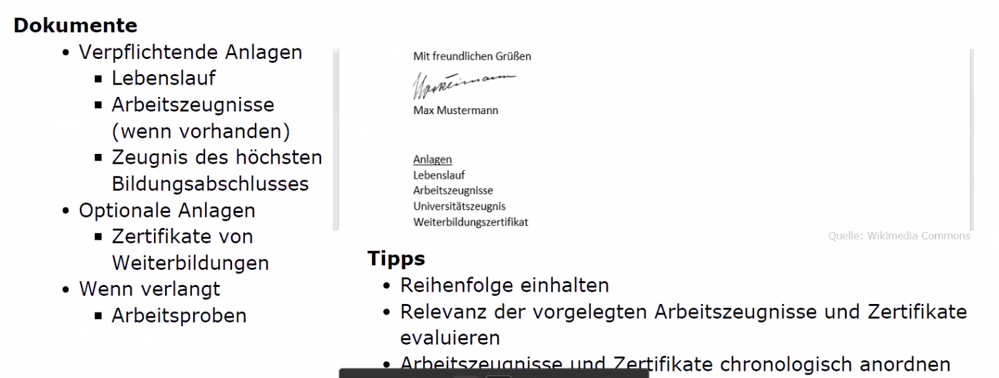

#### Formulierungstipps und Vorlagen

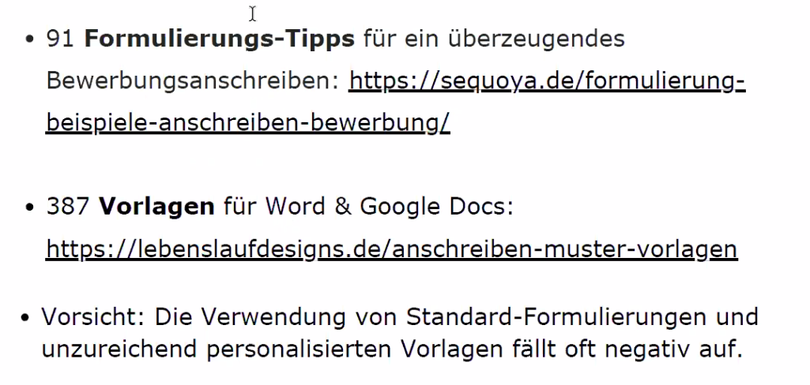

### Der Lebenslauf

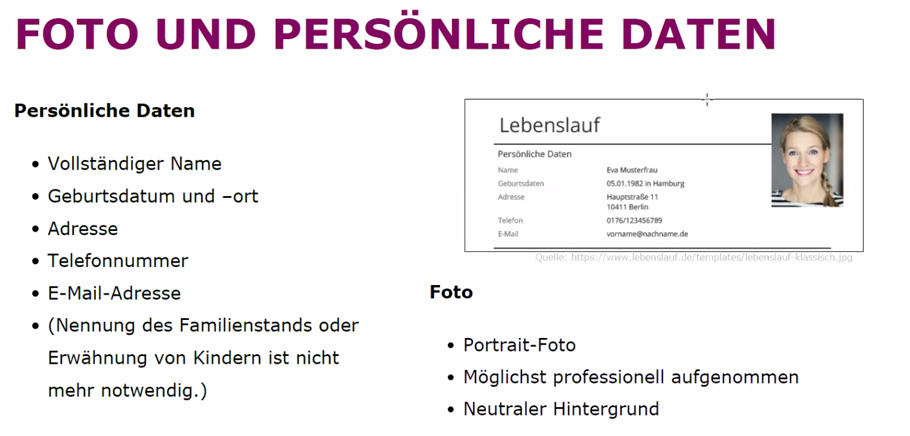
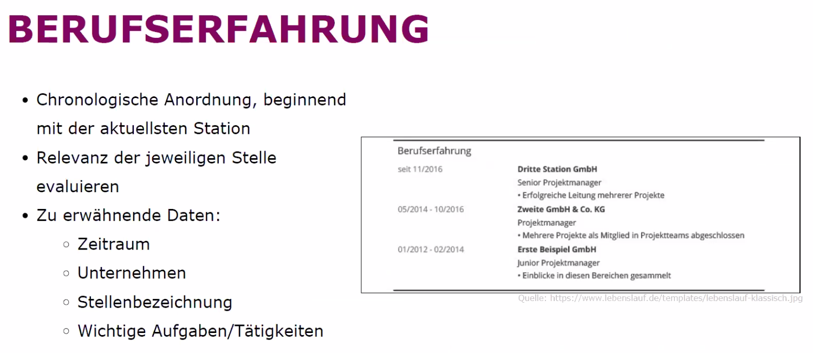
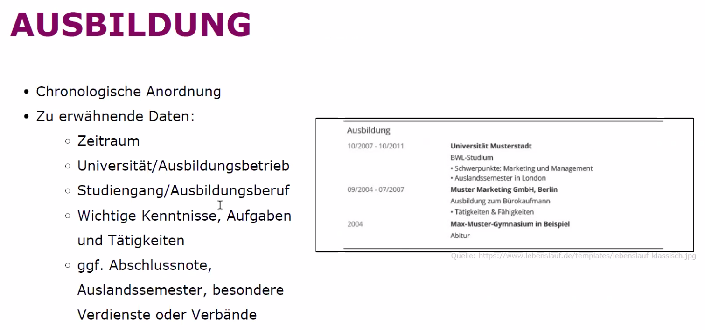
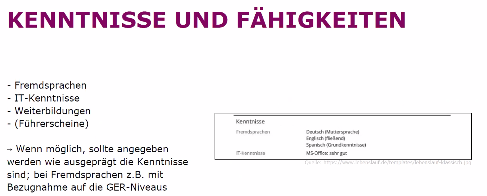

--------------------------------------------------------------------

## Jobs suchen durch Netzwerken

- https://www.spinnen-netz.de/content/diversitaetsorientierte-personalgewinnung
- https://wusgermany.de/de
- www.jugendmigrationsdienste.de (bis 27)
- Migrationsberatung für Erwachsene (MBE) (+27)
- https://www.damigra.de/ (Dachverband der Migrantinnenorganisationen)
- https://www.frnrw.de/ (Flüchtlingsrat in NWR - Such je nach Bundesland)
- https://nebenan.de/
- Volkshochschule Organisation - Lernen- und Kulturangebote
- https://www.vdi.de/mitgliedschaft/nachwuchs/zukunftspiloten
- www.kmk.org (Anerkennungsberatung)
- https://www.make-it-in-germany.com/de/arbeiten-in-deutschland/anerkennung

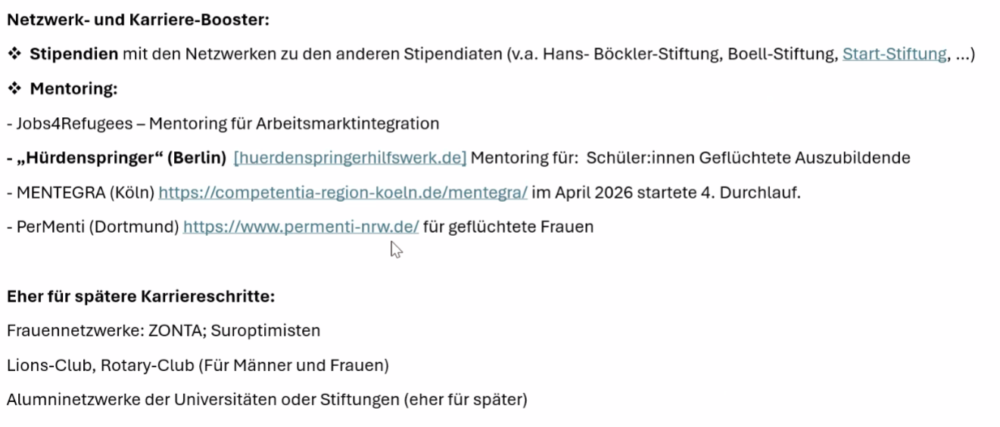
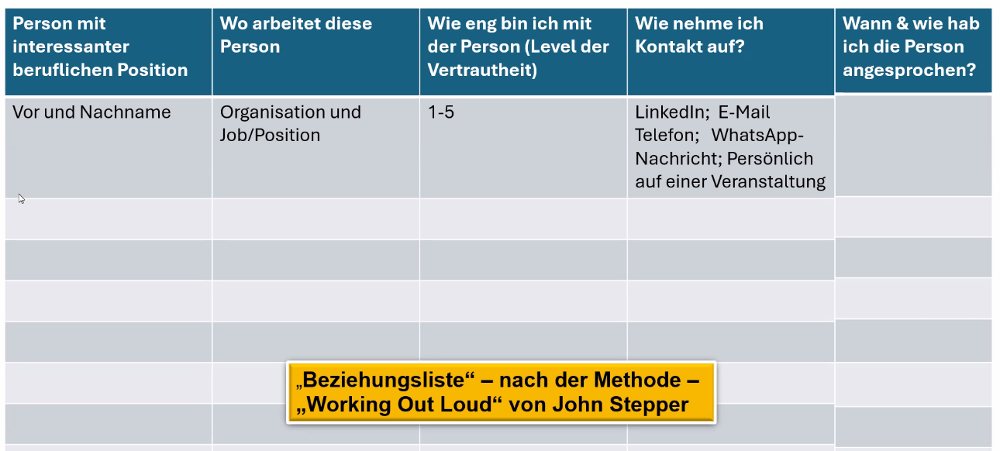
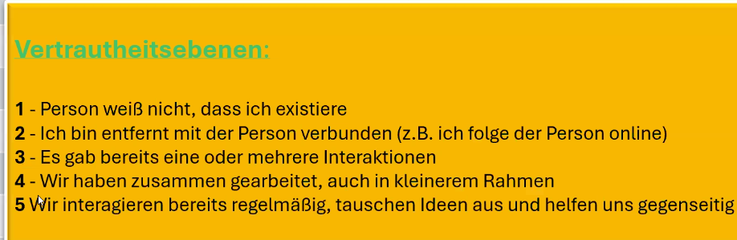
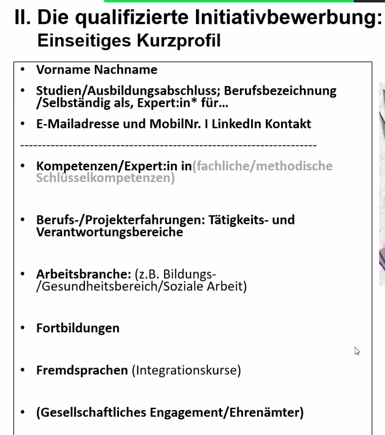
