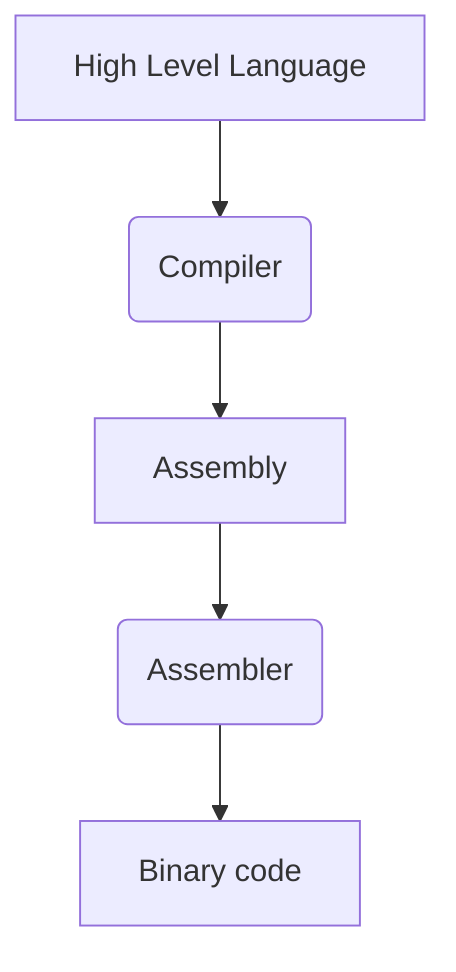

# Electrónica Digital II

>[!Info]
>Un _ASIC_ (Aplication-Specific Integrated Circuit) es un chip de silicio creado para una función específica


## Diseño general

Procedimiento de diseño:
1. Diagrama de flujo
2. Identificar bloques del datapath
3. Identificar señales e interconexiones en el datapath
4. Diagrama de estados
5. Implementación en HDL


### Diagrama de flujo

Muestra el algoritmo del programa de manera secuencial con bloques que definen su comportamiento.


### Datapath

Representa un diseño digital por medio de bloques, los cuales representan los módulos del programa. Las flechas entrantes a cada bloque son las entradas, mientras que las salientes son salidas.


### Diagrama de estados

Cada bloque representa cada uno de los estados del diseño, las flechas entrantes muestran los valores que deben tener las variables para llegar a ese estado.


## Diseño basado en aplicaciones

Procedimiento:

1.  Diagrama de caja negra
2.  Diagrama de flujo
3.  Definición de la arquitectura
4.  Definición de la unidad de control (es una máquina de estados finita (FSM))


### Diagrama de caja negra

Representa la arquitectura como sistema, donde solo se tiene en cuenta la parte externa (entradas y salidas)


### Representación de la arquitectura

Se divide en:
-   _Datapath_
    -   Determina los componentes o conjuntos de instrucciones que conforma la arquitectura (_ISA_, Instruction Set Architecture)
-   _Unidad de control_
    -   Determina el comportamiento del programa mediante su cambio de estados. Coordina las operaciones del datapath

Pasos:
1.  Definir la arquitectura del Datapath: Seleccionar el grupo de instrucciones que integra la aplicación
2.  Definir la unidad de control: Identificar la secuencia de operaciones del set de instrucciones

Se la da una descripción detallada al diagrama de caja negra, combinando Unidad de control y Datapath


## Procesador

Su arquitectura es la siguiente:


Se compone de:
- _Datapath_
	- Ejecuta las operaciones
- _Unidad de control_
	- Ordena al datapath, memoria y I/O lo que debe hacerse


### Ciclo de instrucción

La unidad de control realiza los siguientes pasos para la ejecución de una instrucción:

1. _Instruction Fetch_
	  - El procesador manda una dirección a la unidad de memoria para encontrar la instrucción solicitada (_opcode_)
2. _Decode_
	  - La instrucción es traducida desde su _opcode_ a la tarea que debe realizar
3. _Data Fetch_
	  - Se toman los datos de la memoria para utilizarlos en la tarea
4. _Execution_
	  - Se ejecuta, dispone y guarda el resultado


### Abstracción

Representa la comunicación entre el usuario en un alto nivel, con la máquina (bajo nivel).



### Set de instrucciones (ISA)

Es el conjunto de instrucciones guardadas en memoria que puede realizar el controlador.

Este set debe ser definido de acuerdo a las instrucciones que se consideren más generales para garantizar libertad de diseño. Un set de instrucciones reducido hace más rápido el sistema.

>[!Note]
> - El $90 \%$ de procesadores son basados en registros, el $10\%$ son basados en pilas
> - Los basados en registros suelen ser más rápidos

Cada instrucción es identificada por un _opcode_ (código de operación) : `<mnemónico> <operandos>`. E.g.: `add $s0, $s1, $s2`

Estos requieren de 0 a 3 operandos.

>[!Info]
> El $50\%$ de procesadores no tienen multiplicador, por lo que esta tarea es hecha por software

- __Ejemplo__ :


>[!Info]
>El compilador universal de C es _gcc_

>[!Note]
>La palabra _SoC (System on Chip)_ hace referencia a un procesador o sistema embebido en un chip, por ejemplo, un procesador o arquitectura programada en una FPGA


## Arquitectura MIPS

Es el procesador más básico (MIPS - Microprocessor without Pipeline Stages). 
Su datapath está representado de la forma:


Su datapath completo es:


- Este es un procesador de 32 bits
	- Sus instrucciones tienen un tamaño de 32 bits. Por tanto, puede haber un máximo de $2^{32}$ instrucciones


### Componentes básicos

- _PC_
	- Program Counter. Almacena la dirección en memoria de la instrucción actual.
	- El PC se incrementa en 4 al pasar de una instrucción consecutiva a otra, ya que, cada instrucción tiene 4 bytes

- Las instrucciones se almacenan en la _memoria de instrucciones_
	- Esta permite lectura y escritura de instrucciones

- Su _Banco de registros_ se compone de 32 registros de 32 bits


Para efectuar operaciones con dos registros, se deben de leer los dos al tiempo, por eso tiene dos entradas de lectura de registros.

- La _ALU_ tiene como entradas los dos registros seleccionados y su señal de control de 4 bits que indica la operación a realizar.


La salidad de detección de Cero se utiliza para la implementación de los saltos condicionales.

- _Memoria de Datos_
	- Almacena datos
	- Solo una de las dos opciones (lectura y escritura) puede estar habilitada


- _Stack Pointer (SP)_
	- Es un registro (se encuentra en el register bank) con la última dirección del último dato insertado en la pila (top of stack).


### Lógica de los saltos condicionales

Las direcciones de memoria se representan usando el _sistema de complemento a 2_, donde el bit más significativo indica el signo (1 si es negativo).
Esto se hace porque se indica una distancia de salto relativa a donde estamos parados (posición 0), por tanto, si se indica un salto negativo, nos desplazamos hacia atrás.
Hay $2^{32}$ instrucciones en total, para indicar qué tanto saltar usamos un número de 32 bits donde el bit más significativo es el signo, los 31 bits restantes representa el número de instrucciones que serán saltadas.

Supongamos que el procesador fuese de 8 bits, el mínimo número que se puede obtener con este sistema es $-128$, el máximo que puede obtenerse es $127$.


Por tanto, el máximo número de instrucciones que puede saltar hacia atrás es $2^{8}$ y el máximo número de instrucciones que puede saltar hacia adelante es $2^{8} - 1$.

>[!Note]
>Ejemplo de complemento a 2 a decimal: $10000001 \to 01111110 + 1 \to 01111111 = 127$, pero como el bit más significativo es 1 originalmente, entonces el resultado es $-127$

Ahora bien, haciendo esta analogía para nuestro procesador de 32 bits, el PC puede saltar como máximo $2^{32} - 1$ instrucciones para adelante y $2^{32}$ instrucciones hacia atrás.

Los $16$ bits menos significativos que salen de la memoria de instrucciones (campo de desplazamiento), pasan a la _unidad de extensión de signo_, la cual tiene como salida al mismo número de $16$ bits que ya venía con el sistema de complemento a dos pero extendido a $32$ bits.


Recordemos que el PC no almacena el número de la instrucción en la que se encuentra, sino que almacena un número de bytes múltiplo de 4.
Siendo así, el número que sale de la unidad de extensión de signo hay que volverlo un número múltiplo de 4, para ello, el número se desplaza dos bits hacia la izquierda, sustituyendo los dos bits menos significativos por $0$'s (todo múltiplo de 4 en binario tiene 2 ceros como bits menos significativos).


Esta cantidad de desplazamiento relativo se suma al valor actual del PC, lo que brinda la dirección de la instrucción del salto. Un multiplexor determinará si se escoge la siguiente instrucción o la del salto. La unidad de control la escoge de acuerdo al resultado de la comparación de los dos registros. La ALU resta los registros para determinar si estos son iguales, en caso de serlo, se activará la salida de detección Cero, lo que significa que el salto será producido.

En instrucciones de tipo R (aritmético-lógicas), la ALU toma los datos de los dos registros, no obstante, para instrucciones de salto, la seguna entrada de la ALU es el número proveniente de la extensión de signo para el cálculo de la dirección.

En instrucciones tipo R se guarda el valor resultante de la ALU en el banco de registros. Pero si se quiere cargar un dato, el banco lo toma de la memoria.


### Ciclos de ejecución

Los ciclos de ejecución de este procesador son:
1. _Instruction Fetch_
	- El PC manda una dirección a la memoria de instrucciones, esta brinda el opcode de la instrucción
	- $PC += 4$
2. _Decode_
	- A partir del _opcode_ se determina:
		- Tipo de instrucción
		- Longitud de los campos
		- Datos que se le van a pedir al banco de registros

Organización para R-type (instrucciones aritmético-lógicas):


>[!Note]
>El _opcode_ tiene un tamaño de 8 bits

3. _Execute_
	- Se realizan las operaciones en la ALU

4. _Memory Acess_
	- Es una etapa adicional exclusiva para las operaciones _LW_ (load word) y _SW_ (store word)

5. _Register Write_
	- Aplica para las instrucciones que escriben en registros


## Arquitectura J1

Es una arquitectura Von Neumann de 16 bits.

Su datapath es el siguiente:


Los ciclos _instruction fetch_ y _decode_ suceden en paralelo con _execute_ en la ALU.

$T'$ es el nuevo valor para $T$, así como lo es $PC'$ y $R'$

### Componentes básicos

- _PC_
	- Tiene 13 bits

- _Data Stack_
	- Es una pila de $33 \times 16$ bits
	- El elemento de arriba de la pila usa la notación $T$ (top)
	- El segundo elemento de la pila usa la notación $N$ (next)

- _Return Stack_
	- Es una pila de $32 \times 16$ bits
	- El elemento de arriba de la pila usa la notación $R$ (return)
	- Sirve para almacenar la dirección de la instrucción actual en caso de saltos

- _Memoria RAM_
	- Es de $8k \times 16$ bits
	- Almacena las instrucciones


### Codificación de las instrucciones

El procesador cuenta con 5 tipos de instrucciones, todas ellas cuentan con 16 bits.
Los primeros números del opcode (_aluop_ que sale del módulo _Decode_) determinan el tipo de instrucción como se puede ver en la imagen:


El tipo de instrucción _ALU_ se divide en varios campos, estos significan:


El campo $T'$ indica la operación de la ALU a realizarse. Estas pueden ser:


Este código de operación de 4 bits se guarda en $T$.

El campo $dstack \pm$ mueve el Stack Pointer de la pila de datos. Su primer bit es el signo, si es $1$, es negativo, por lo que el apuntador se desplazará hacia arriba, de lo contrario, el nuevo top será $N$. El segundo bit es la distancia de desplazamiento, así que solo se puede desplazar $1$.
Lo mismo sucede con $rstack \pm$, sin embargo, aplica para la pila de retorno.

El campo $N \to [T]$ indica si se escribirá el valor de $N$ en la dirección de $T$ ($[T]$) en la memoria RAM.


>[!Info]
>La _compilación cruzada_ es compilar un código que será ejecutado en un dispositivo o plataforma diferente a donde reside el compilador.
>
>Ejemplo: El compilador reside en una laptop, pero se ejecuta en una FPGA


## Interfaz software-hardware

El usuario manda instrucciones al procesador mediante un lenguaje de alto nivel, el compilador convierte el código a lenguaje de máquina (Assembly), luego se compila de nuevo con Assembler para convertirlo a código binario.


_Forth_ es un lenguaje de programación orientado en pilas creado por Chuck Moore y usado por primera vez en 1970. Este lenguaje es usado como herramienta de generación de instrucciones del procesador. Su compilador es _gforth_. Los archivos de código forth tienen extensión _.fs_.

El archivo _Makefile_ de un proyecto automatiza los procesos de compilación, definiendo qué archivos compilar y qué compiladores usar. Así como también implementa rutinas de limpieza de archivos y documentación. Contiene instrucciones de compilación y enlazamiento de los archivos de código del proyecto. 
Estos son archivos de texto, no están escritos en ningún lenguaje, pero tienen un formato estructurado en su escritura.

En Linux, se ejecuta el archivo _Makefile_ del mismo nombre usando el comando `make all`

Ejemplo del uso de un archivo _Makefile_ para compilar un programa escrito en c:

```makefile
CC = gcc    # Guarda en la variable el compilador
CFLAGS = -Wall -g    # Especifica las opciones de compilación

# Se definen las reglas para compilar el archivo ejecutable 'programa' a partir de los archivos objeto 'archivo1.o' y 'archivo2.o'

programa: archivo1.o archivo2.o
	$(CC) $(CFLAGS) archivo1.o archivo2.o -o programa

# Se definen las reglas para compilar el archivo 'archivo1.c' (utiliza la dependencia 'archivo1.h') y guardarlo en 'archivo1.o'

archivo1.o: archivo1.c archivo1.h
	$(CC) $(CFLAGS) -c archivo1.c -o archivo1.o

# Se definen las reglas para compilar el archivo 'archivo2.c' (utiliza la dependencia 'archivo2.h') y guardarlo en 'archivo2.o'

archivo2.o: archivo2.c archivo2.h
	$(CC) $(CFLAGS) -c archivo2.c -o archivo2.o

# Regla para borrar los archivos objeto y programa

clean:
	rm -f *.o programa
```


# Clases


$$
\begin{align*}
	maxSaltoInst = \underbrace{ 2^{2} }_{ shiftLeft2 } *\underbrace{ 2^{16-1} }_{ SignExtend-signo+Significativo }
\end{align*}
$$


Fetch, Decode, Execute

Este procesador almacena por cada una de estas -> se penaliza en tiempo

El primero era secuencial, pero este es semiparalelo

- _GIPS_ : Giga instrucciones por segundo

---

>[!Info]
>El $80\%$ de los procesadores tienen un registro 0 para hacer una inicialización segura -> Asegurarse que los datos son los datos iniciales

Varias ventanas de registros permiten tener procesos más rápidos

>[!Info]
>La arquitectura Spark tiene un grupo de 8 ventanas (8 BR)

- Carga inmediata de datos las instrucciones terminan en $i$


---

# Proyecto


```c
import audios

configPerifericos()
while(1) {
	while(!dataAvail()) {
	}
	data = ESP32GetData()
	Position pos = new Position()
	pos.x, pos.y = data.posInit.x, data,posInit.y
	distObj, dirObj = calcularDistDir()
	dir = data.dir
	audioSel = Iniciar
	
	while(Ex > data.error and Ey > data.error) {
		emitirAudio(audioSel)
		audioSel = ''
		
		detected = detectarObstaculo()
		if detected {audioSel = Obstaculo}
		
		motionMode = accionarMotores(dir, detected)
		actualizarPosicion(motionMode)
		recalcularError()
	}
	emitirAudio(Fin)
	ESP32PostData(Done)
	clean()
}

function emitirAudio(audioSel) {
	switch audioSel {
		case Iniciar: audio = Audio1
		case Obstaculo: audio = Audio2
		case Fin: audio = Audio3
		default: return
	}
	enviarAudioI2S(audio)
}

function recalcularError() {
    Ex = abs((data.posFinal.x - pos.x)/data.posFinal.x)*100
    Ey = abs((data.posFinal.y - pos.y)/data.posFinal.y)*100
}

function actualizarPosicion(motionMode) {
	if(!motionMode) {
		return
	}
	if(motionMode) {
		pos.x += curveDist(dir, x)
		pos.y += curveDist(dir, y)
	} else {
		pos.x += dDist*cos(dir)
		pos.y += dDist*sin(dir)
	}
}

function accionarMotores(dir, detected) {
	if(dir != dirObj) {
		rotar()
		return 0
	}
	if(detected) {
		hacerCurva()
		return 1
	}
	avanzar()
	return 2
}
```


## External links

- [Verilog](Verilog.md)
