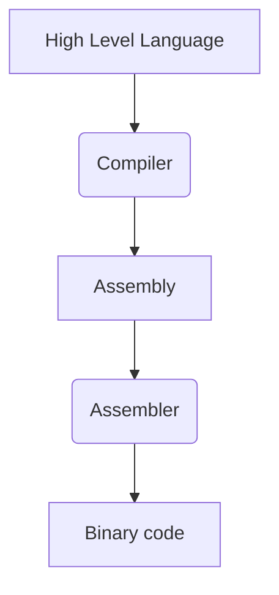

# Electrónica Digital II

>[!Info]
>Un _ASIC_ (Aplication-Specific Integrated Circuit) es un chip de silicio creado para una función específica

## Diseño general

Procedimiento de diseño:
1. Diagrama de flujo
2. Identificar bloques del datapath
3. Identificar señales e interconexiones en el datapath
4. Diagrama de estados
5. Implementación en HDL

### Diagrama de flujo

Muestra el algoritmo del programa de manera secuencial con bloques que definen su comportamiento.

### Datapath

Reperesenta un diseño digital por medio de bloques, los cuales representan los módulos del programa. Las flechas entrantes a cada bloque son las entradas, mientras que las salientes son salidas.

### Diagrama de estados

Cada bloque representa cada uno de los estados del diseño, las flechas entrantes muestran los valores que deben tener las variables para llegar a ese estado.

## Diseño basado en aplicaciones

Procedimiento:

1.  Diagrama de caja negra
2.  Diagrama de flujo
3.  Definición de la arquitectura
4.  Definición de la unidad de control (es una máquina de estados finita (FSM))

### Diagrama de caja negra

Representa la arquitectura como sistema, donde solo se tiene en cuenta la parte externa (entradas y salidas)

### Representación de la arquitectura

Se divide en:
-   _Datapath_
    -   Determina los componentes o conjuntos de instrucciones que conforma la arquitectura (_ISA_, Instruction Set Architecture)
-   _Unidad de control_
    -   Determina el comportamiento del programa mediante su cambio de estados. Coordina las operaciones del datapath

Pasos:
1.  Definir la arquitectura del Datapath: Seleccionar el grupo de instrucciones que integra la aplicación
2.  Definir la unidad de control: Identificar la secuencia de operaciones del set de instrucciones

Se la da una descripción detallada al diagrama de caja negra, combinando Unidad de control y Datapath

## Procesador

Su arquitectura es la siguiente:

Se compone de:
- _Datapath_
	- Ejecuta las operaciones
- _Unidad de control_
	- Ordena al datapath, memoria y I/O lo que debe hacerse

### Ciclo de instrucción

La unidad de control realiza los siguientes pasos para la ejecución de una instrucción:

1. _Instruction Fetch_
	  - El procesador manda una dirección a la unidad de memoria para encontrar la instrucción solicitada (_opcode_)
2. _Decode_
	  - La instrucción es traducida desde su _opcode_ a la tarea que debe realizar
3. _Data Fetch_
	  - Se toman los datos de la memoria para utilizarlos en la tarea
4. _Execution_
	  - Se ejecuta, dispone y guarda el resultado

### Abstracción

Representa la comunicación entre el usuario en un alto nivel, con la máquina (bajo nivel).

### Set de instrucciones (ISA)

Es el conjunto de instrucciones guardadas en memoria que puede realizar el controlador.

Este set debe ser definido de acuerdo a las instrucciones que se consideren más generales para garantizar libertad de diseño. Un set de instrucciones reducido hace más rápido el sistema.

>[!Note]
> - El $90 \%$ de procesadores son basados en registros, el $10\%$ son basados en pilas
> - Los basados en registros suelen ser más rápidos

Cada instrucción es identificada por un _opcode_ (código de operación) : `<mnemónico> <operandos>`. E.g.: `add $s0, $s1, $s2`

Estos requieren de 0 a 3 operandos.

>[!Info]
> El $50\%$ de procesadores no tienen multiplicador, por lo que esta tarea es hecha por software

- __Ejemplo__ :

>[!Info]
>El compilador universal de C es _gcc_

# Clase

$$
\begin{align*}
	maxSaltoInst = \underbrace{ 2^{2} }_{ shiftLeft2 } *\underbrace{ 2^{16-1} }_{ SignExtend-signo+Significativo }
\end{align*}
$$

Fetch, Decode, Execute

Este procesador almacena por cada una de estas -> se penaliza en tiempo

El primero era secuencial, pero este es semiparalelo

- _GIPS_ : Giga instrucciones por segundo

## External links

- [Verilog](Verilog.md)
