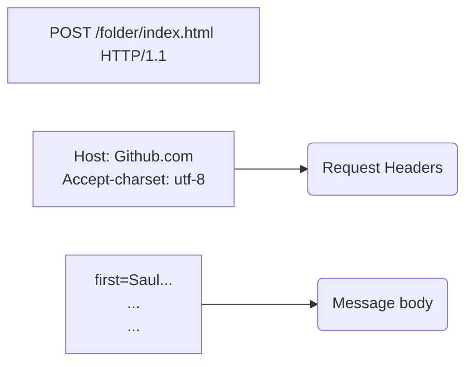
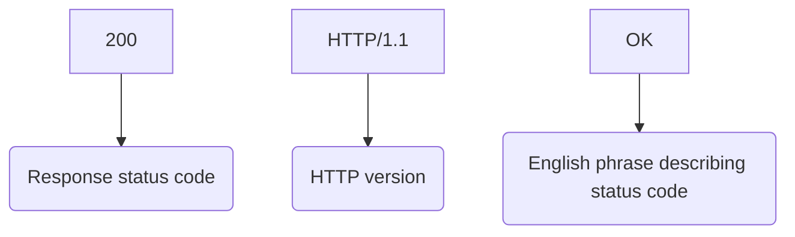
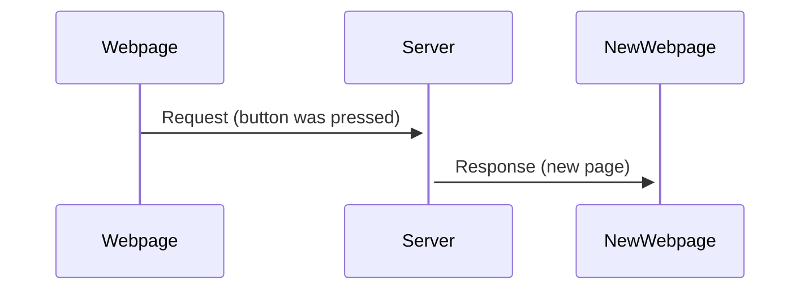
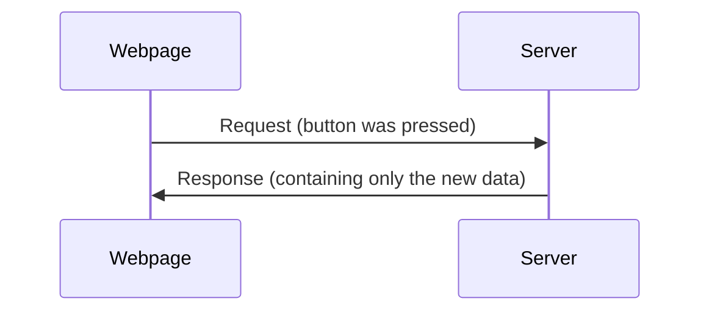

# Server communication

## HTTP basics

Is an stateless protocol, doesn't storage any data as a user connect to a server (e.g.: the history of connected users).

### HTTP Request structure (GET)

```mermaid
graph TD
GET --> A(Method)
/folder/index.html --> B(URI String)
?first=Saul&last=Goodman --> C(Query String)
HTTP/1.1 --> D(HTTP version)
```

### HTTP Request structure (POST)



### HTTP Response Sructure



The response also contains below a header and below of it the content.


### Some Response Status Codes

- 200 OK
- 403 Forbidden
- 404 Not Found
- 500 Internal Server Error


## AJAX

Stands for Asynchronous Javascript and XML.
Is just a client-server communication technique.
Nowadays, JSON is used instead, then few devices use Ajax.

Traditional web app flow does a request to the server every time the user does a request, so the page changes and the server answers with the data of a whole new web page (it doesn't matters if it only changed 99% since the last request).



In the other hand, Ajax app flow does a server response which involves only the data changed, in order that it's not necessarily to provide the whole data as a new web page.



Suppose a faster response as takes less bandwidth.

Being asynchronous supposes Ajax executes more than one instruction at a time, since parallel tasks are being executed.


### Coding the communication

Before working with this we need to make sure our browser supports Ajax, to do so, `XMLHttpRequest` must exists as a window's attribute. Old browsers does not contain this element, but they have an `ActiveXobject` attribute instead. These attributes are request objects.

Requests have 4 stages, being the fourth as the last one, which means the request is ready to go, for checking so, use the request object's attribute `readyState` which indicates the current state, therefore it must be equal to 4. 
Moreover, before sending a request we must make sure it response status code is 200 (which means the server agrees the connection), the request object's attribute `status` indicates it.


For making a request is used the `open()` method. For instance:

```js
var requestURL = "/floder/index.html";
XMLHttpRequest.open("GET", requestURL, true);
```

The last boolean parameter indicates if it's using the protocol as asynchronous or not.
Hence, by setting it to `false` the browser will freeze and wait until the server answers.
Now, for sending the request to the server we use:

```js
XMLHttpRequest.send(null);
```

The parameter inside that function is actually the body of a __POST__ request.

The response from the server will be available in the `responseText` attribute of the request object.


## JSON

Stands for Javascript Object Notation. Is a simple and shorter data-interchange format for passing data from server to client and back.
Property names and Strings must be in double quotes. For instance:

```js
var jsonString =
'{
	"firstName": "Saul",
	"lastName": "Goodman",
	"age": 48,
	"in prisson": true
}'
```

The object was wrapped with single quotes because there are already double quotes inside of that string.

Converts from json string to object:

```js
var obj = JSON.parse(jsonString);
```

Converts from object to a json string:

```js
var str = JSON.stringify(obj);
```

A json string can be stored in a json file like this:

```json
{
	"firstName": "Saul",
	"lastName": "Goodman",
	"age": 48,
	"in prisson": true
}
```
