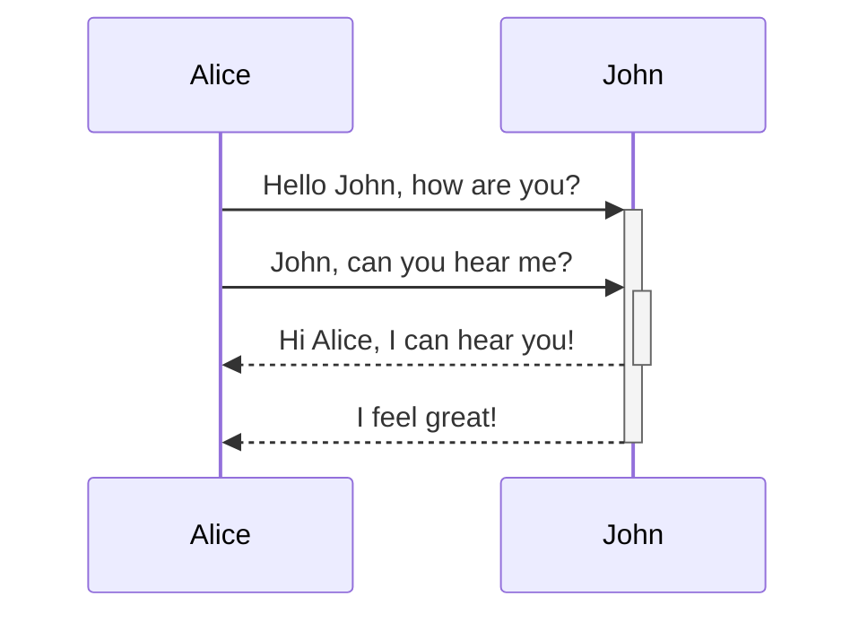
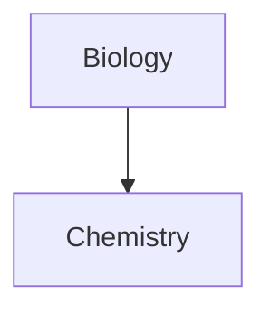
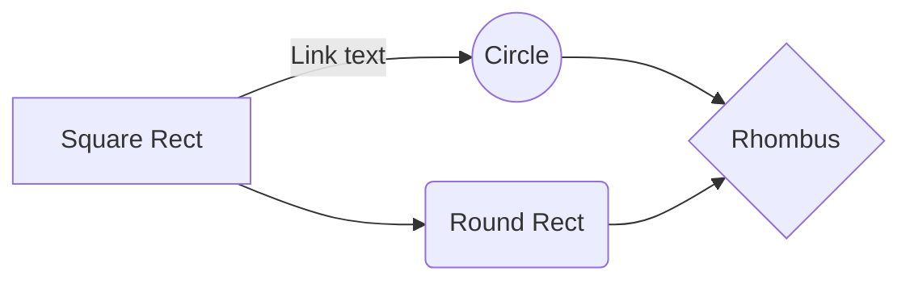
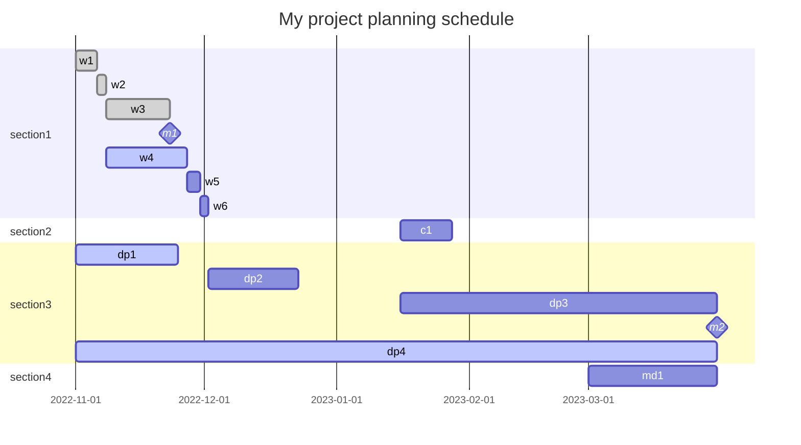

# Obsidian basics

- Linking [[Linked note]].
- Internal links: Look also for [External links](#external+links)
- Tagging #tag 
- *Italic*, also _italic_
- **Bold**, also __bold__
- Headers:
	- # Main header
	- ## 2nd header
	- ### 3rd header
	- #### 4th header
	- ##### 5th header
	- ###### 6th header

- ## Images:

	
(Notice that the image is resized to 450px)


## External links:
[ObsidianHelp](https://help.obsidian.md/How+to/Format+your+notes)


## Blockquotes:
> Human beings face ever more complex and urgent problems, and their effectiveness in dealing with these problems is a matter that is critical to the stability and continued progress of society. 
   \- Doug Engelbart, 1961


## Inline code:
The `sleep()` command in the C language is used in a microcontroller for entering to the total low power managed mode.


## Code blocks:

```Python
	def factorial(n):
		if(n == 0):
			return 1
		return n*factorial(n - 1)
```


## Task lists:
- [x] First task
- [x] Second task
- [x] Third task
- [ ] Last task


## Tables:

|First header | Second header |
	| --------------- | ----------------- |
	|First content | Second content |
	|Additional content | Additional content |


## Strikethrough:
~~This should appear crossed out. ~~


## Highlighting:
==Higlighted text.==


## Horizontal bars:

___

---

## Footnotes:
Here's a sample footnote[^1].

[^1]: A meaningful footnote


## Math syntaxis:

$$e^{i\theta} = Cos(\theta) + iSin(\theta)$$


## Matrices:

$$\begin{vmatrix}
a & b\\
c & d
\end{vmatrix} = ad - bc$$


## Comments:

%%This comment can't be seen in the reading mode%%


## Callouts:

> [!Info]
 Here's a callout block.

> [!Note]
 Here's another one.

>[!Warning]
>Here's a warning block.


## Diagrams:

Mermaid provides the following diagram types:

-   Flowchart
-   Sequence diagram
-   Class Diagram
-   State Diagram
-   Entity Relationship Diagram
-   User Journey
-   Gantt
-   Pie Chart
-   Requirement Diagram

### Sequence diagram



### Flowcharts

Use `graph XX`, the 2 `XX` sets the diagram orientation flow as follows this convention:

| Parameter | Meaning |
| ---------- | ----------- |
| TD | Top-Down |
| LR | Left-Right |
| TB | Top-Bottom |






### Gantt diagrams




>[!info]
>Mardown supports LaTex commands by wrapping them with `$$`


