# Power BI

[Course Video](https://www.youtube.com/watch?v=cyWVzAQF9YU)

- Using a cell value within a string in another cell
  - *Example:* Brand URL = "https://github.com/images/B"& [Brand Id] &".png"

- Setting number of decimals can be done by using hashes
  - *Example:* #,###.00
  - *Example:* #,###

## DAX

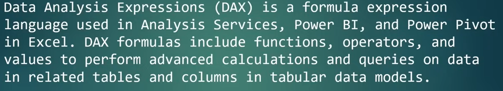

DAX Measures:

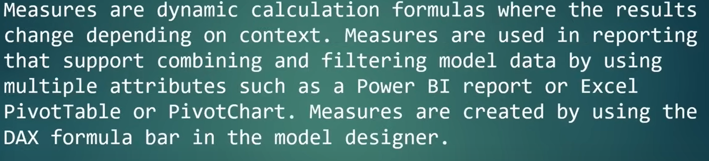

DAX Calculated Columns:

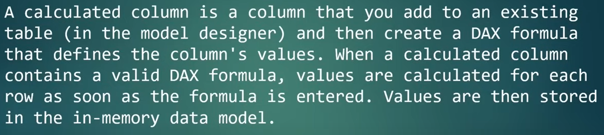

DAX Calculated Tables:

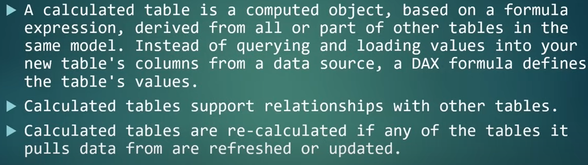

DAX Visual Calculation:

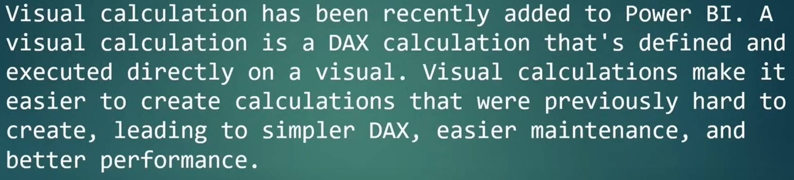

DAX Queries:

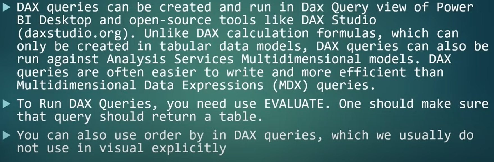

DAX Data Types:

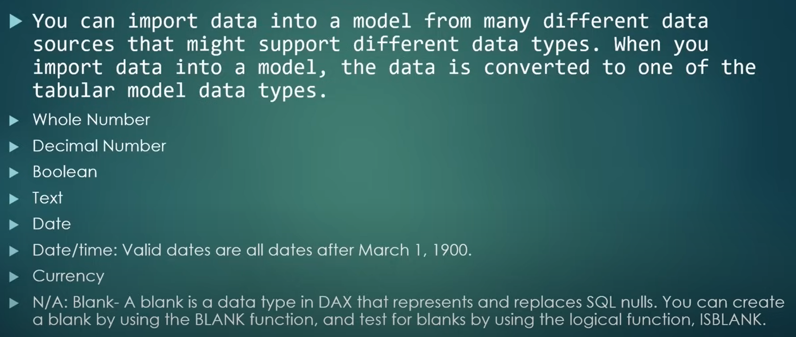

DAX Variables:

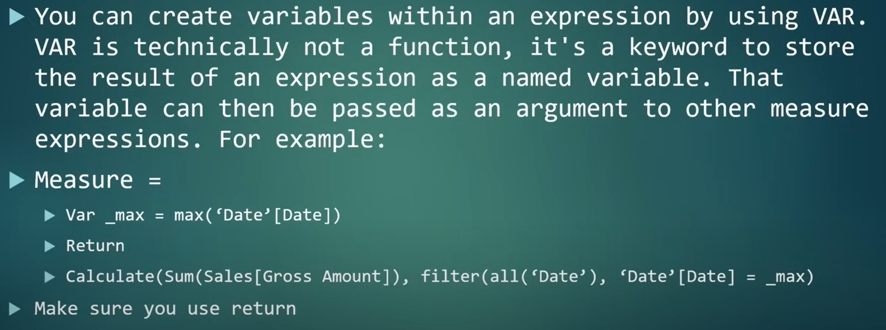

Context:

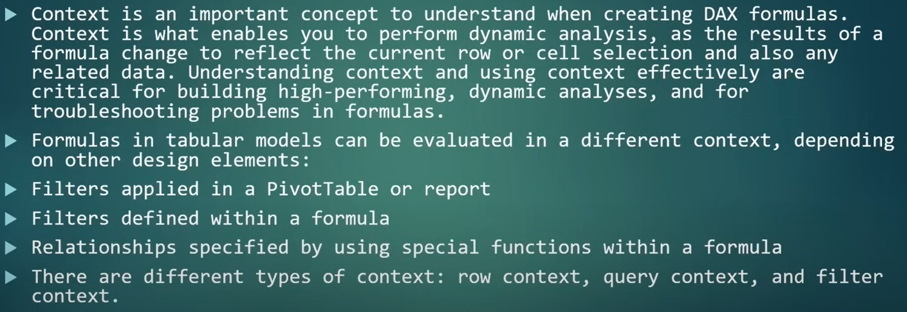

Row context:

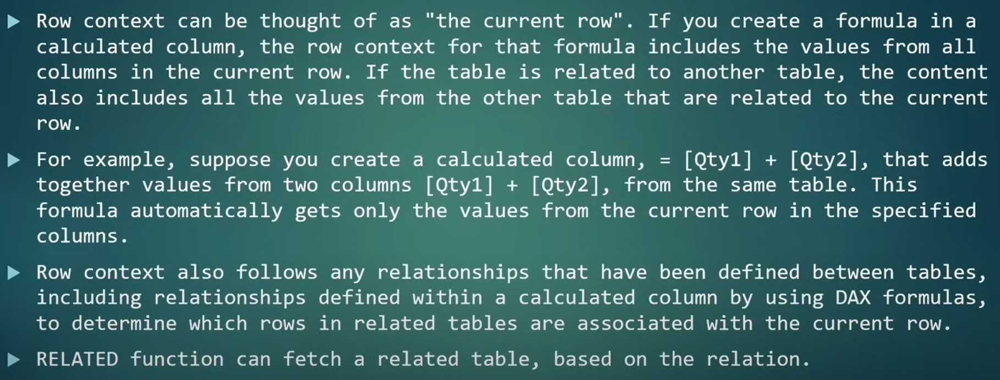

Multiple Row Context:

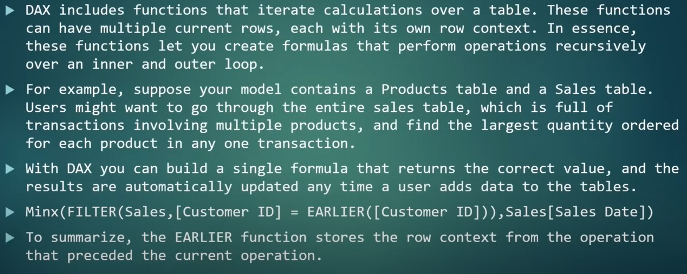

Query Context:

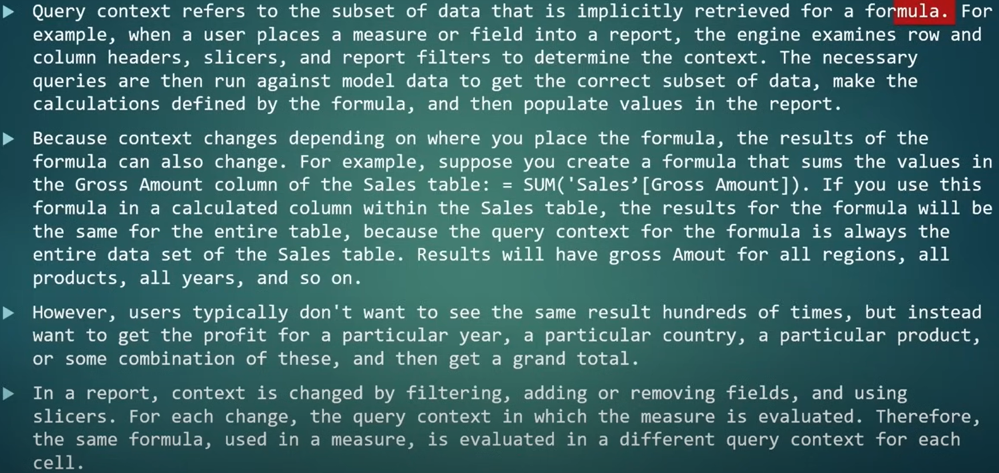

Filter Context:

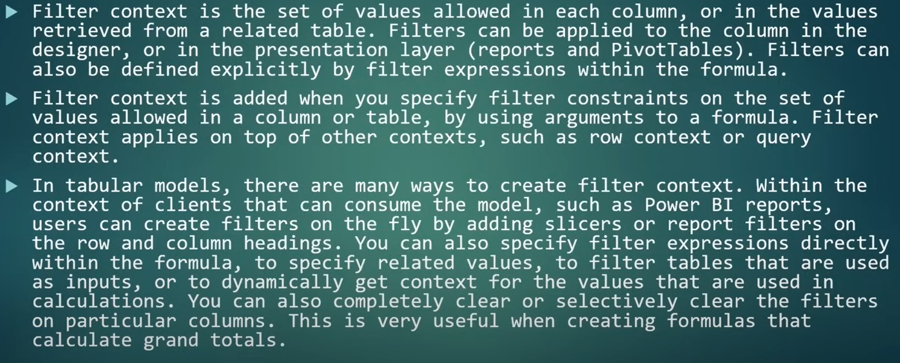

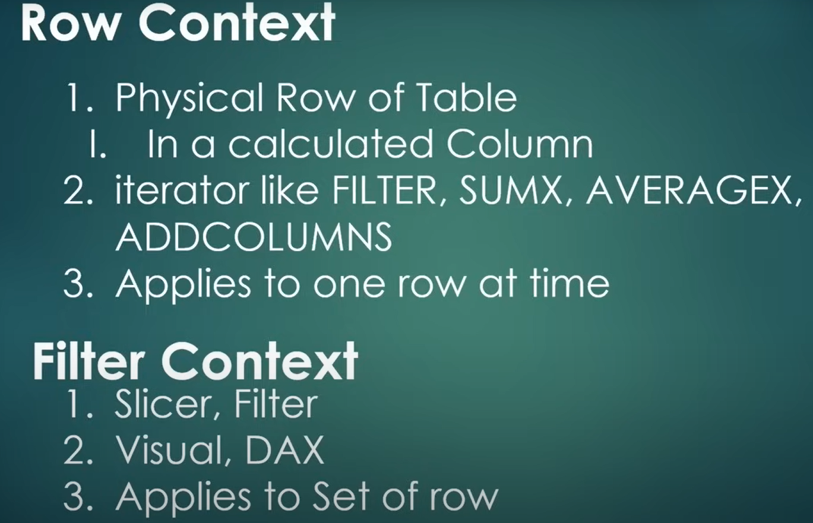

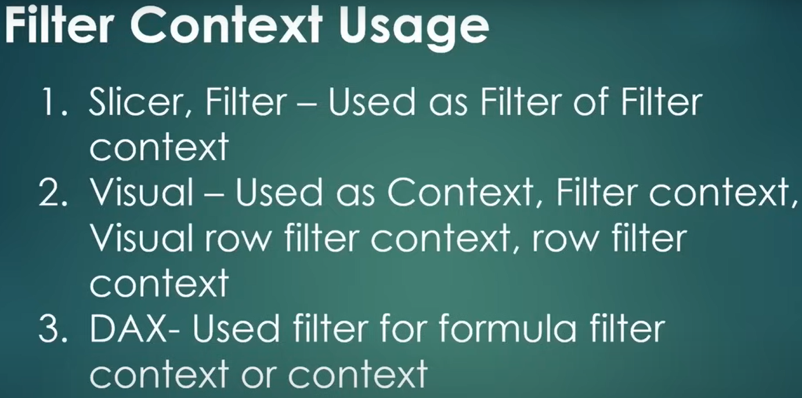

### Usage Examples

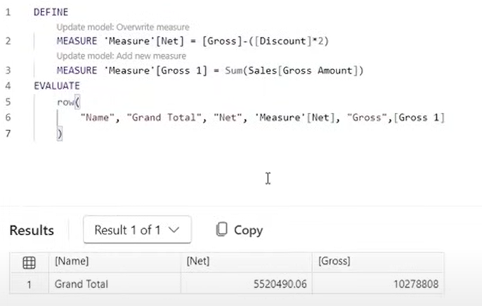

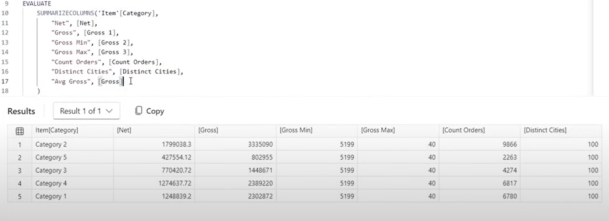

---

Using IF statement in the table view:

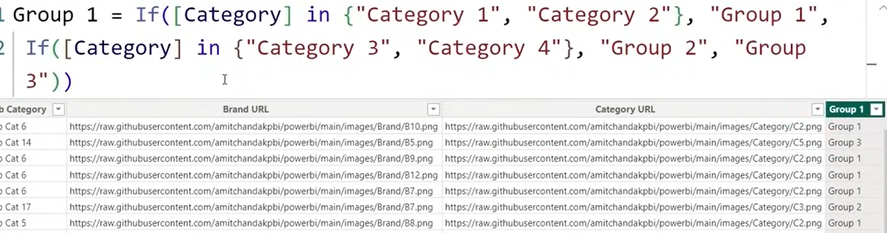

Using SWITCH statement in the table view:

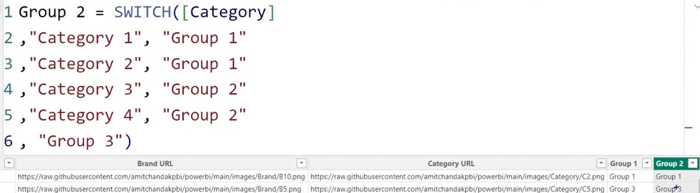

Another alternative with SWITCH in the table view:

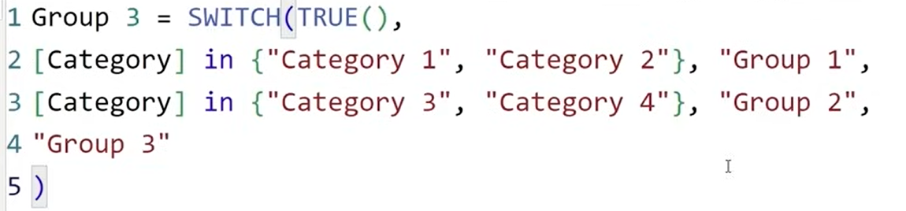

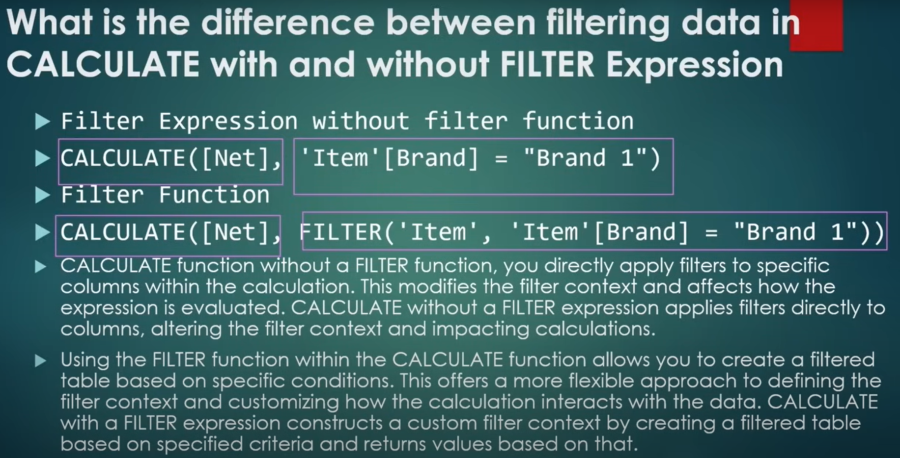

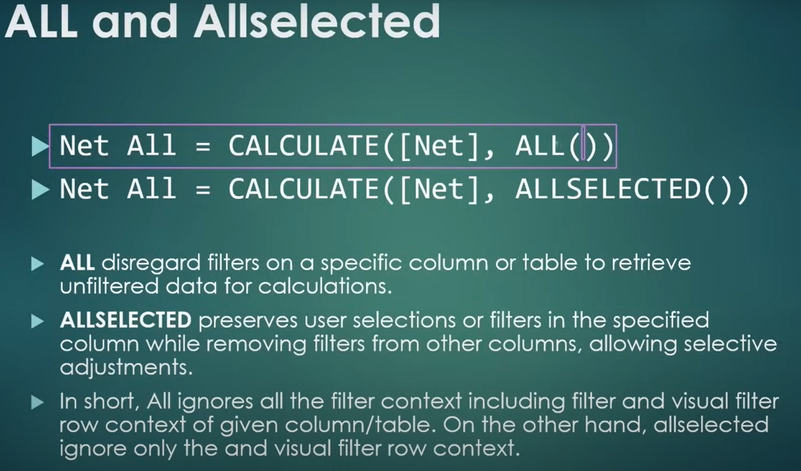

## EARLIER Function

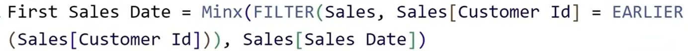

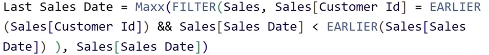

